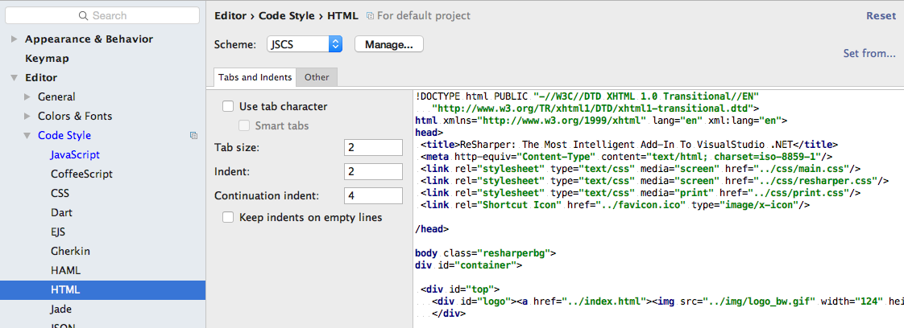

#WebStorm IDE

##Preparation

So that we can programmatically enforce a style guide as we progressively develop our application it is necessary to install an application named **jscs**. Here are brief instructions to install the app in both Windows 10 and Mac OSX.

## Install nodejs

Instructions here: 

- <https://nodejs.org/>


## Install jscs

This must be done from a command shell - and relies on a successful node installation.

```
npm install jscs -g
```

##WebStorm installation & configuration

Download and install [WebStorm](https://www.jetbrains.com/webstorm/download/) version appropriate to your operating system.


Follow the [JetBrains instructions](https://www.jetbrains.com/student/) to obtain a free student license. For this you will require a valid academic student email address. Copy the license to a text file and save for future use.


Once you have installed Webstorm, launch the application and:

- Register your application using the student license,
- Click the gear icon and select preferences in the context menu.


Select the Editor in the Preferences pane.


As shown in Figure 6, on the Preferences | Editor | Code Style | JavaScript pane, set the Tab size, Indent and Continuation indent to 2, 2 and 4 respectively.


Download and save to a permanent location [this customized JSCS config file archive](archive/jscsrc.zip). Expand the archive. It contains a single file name **.jscsrc**. 

Still in the JavaScript pane (referring to Figure 7 and Figure 8):

- Press the Manage button (Scheme) press OK to import JSCS config file. 
- Browse to the location where you have saved the **.jscsrc** file, select it and press OK. The Import from JSCS config pane should then open. 
- In the Code style preset dropdown pane select Airbnb. Press OK.
- You should then be returned to the Default Preferences pane. Ensure the Tab size, Indent and Continuation indent values are 2, 2 and 4 respectively, as shown in Figure 6, resetting them if necessary, 2.


Still in the Default Preferences | Editor pane, select HTML and set the Tab size, Indent and Continuation indent at 2, 2, 4 respectively as shown in Figure 9. The Scheme should be set to JSCS, provided by the customized **.jscsrc** file imported earlier.


As shown in Figure 10, select JSCS in the Preferences | Languages & Frameworks pane

- Tick the Enable checkbox 
- Select *Airbnb* in the *Code style preset* dropdown.


In the Preferences | Languages & Frameworks select JavaScript and set the language version to ECMAScript 6. See Figure 11.


In Editor | JSON set Tabs and Indents pane as shown in Figure 12, that is, untick *Use tab character*, set *Tab size*, *Indent* and *Continuation indent* at 2, 2, 4 respectively.


Press the Apply and OK buttons at the foot of the preferences pane to return to the WebStorm spash screen. 

Tip: As you progress through the labs you may encounter style guide errors in the code you enter in WebStorm editor. Study Figure 13 to understand how these may be corrected using the JSCS rules application.

To correct indentation invoke the menu command *Code | Reformat Code*. It is much more efficient to use the hot keys for this task. See Figure 14. 


You are now ready to commence development using WebStorm.


