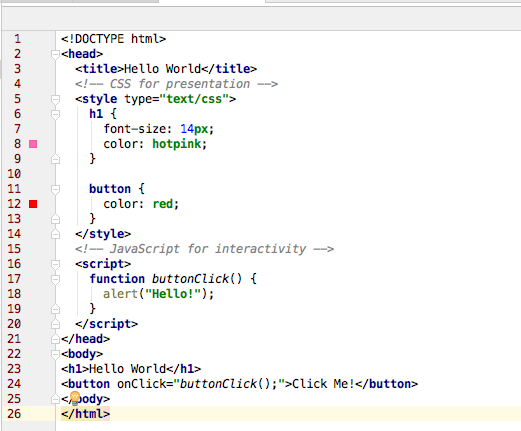
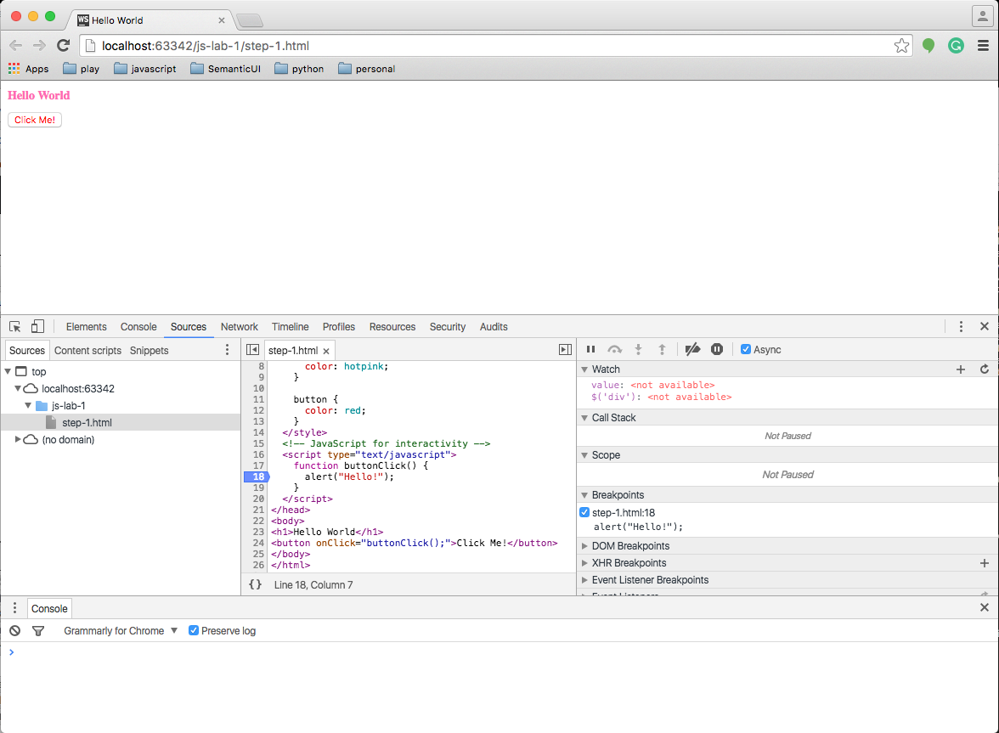

#Getting Started

##Anatomy of a Web Page
Before diving into JavaScript, it helps to understand how it aligns with the other web technologies.

###HTML is for Content
HTML is a markup language used to define and describe content. Whether it be a blog post, a search engine result or an e-commerce site, the core content of a web page is written in HTML. A semantic markup, HTML is used to describe content in universal terms (headers, paragraphs, images, etc.).

###CSS is for Presentation
CSS is a supplemental language that applies style to HTML documents. CSS is all about making content look better by defining fonts, colors and other visual aesthetics. The power of CSS comes from the fact that styling is not intermingled with content. This means you can apply different styles to the same piece of content, which is critical when building responsive websites that look good across a range of devices.

###JavaScript is for Interactivity
In the browser, JavaScript adds interactivity and behavior to HTML content. Without JavaScript, web pages would be static and boring. JavaScript helps bring a web page to life.

Look at this simple HTML page that includes CSS and JavaScript to see how it all fits together:

```html
<!DOCTYPE html>
<head>
  <title>Hello World</title>
  <!-- CSS for presentation -->
  <style type="text/css">
    h1 {
      font-size: 14px;
      color: hotpink;
    }

    button {
      color: red;
    }
  </style>
  <!-- JavaScript for interactivity -->
  <script>
    function buttonClick() {
      alert("Hello!");
    }
  </script>
</head>
<body>
<h1>Hello World</h1>
<button onClick="buttonClick();">Click Me!</button>
</body>
</html>
```

In the example above, HTML is used to describe the content. The "Hello World" text is described as a heading with the `<h1>` tag and "Click Me!" is described as a button with the `<button>` tag. The `<style>` block contains CSS that changes the font-size and color of the header text. The `<script>` block contains JavaScript that adds interactivity to the button. When a user clicks on the button, an alert message will appear that says "Hello!".

In this example, for convenience, we have included the JavaScript in the HTML. This practice is not recommended and henceforth we shall place such code in an external file or files.

##A Scripting Language for the Web
JavaScript was originally designed to add interactivity to web pages, not to be a general programming language, which makes it a scripting language. [Scripting languages](http://en.wikipedia.org/wiki/Scripting_language) are regarded to be more productive than general languages because they are optimized for their specific domain (in this case, the web browser). However, recent advancements have brought JavaScript to the server-side (via [Node.js](http://nodejs.org/)) so it can now be used in place of languages like PHP, Ruby or ASP. This guide will focus exclusively on JavaScript running in the browser with jQuery.

The name "JavaScript" is a bit misleading. Despite the similarity in name, JavaScript has no relationship with [Java](http://en.wikipedia.org/wiki/Java_\(programming_language\)), a general purpose language. JavaScript is based on an Open Web standard called [ECMAScript](http://en.wikipedia.org/wiki/ECMAScript). Standards-based languages are not controlled by any one entity or corporation - instead, developers work together to define the language, which is why JavaScript will run in *every* web browser regardless of the operating system or device.

##What You Need to Get Started with JavaScript and jQuery
1. Web Browser
2. Text Editor
3. Developer Tools (optional)

One of JavaScript's greatest strengths is its simplicity. It can be written and run on any operating system, and the only requirements are a web browser and a text editor. There are also numerous tools that can make JavaScript development more productive, but they are completely optional.

In this series of labs, however, we shall use a text editor within the WebStorm integrated development environment (IDE). This provides us with a number of advantages, mainly the ability to apply styleguide rules. We have chosen [Airbnb Style Guide](http://airbnb.io/javascript/) from an available list the includes Crockford, Google and others.
Commonly referred to as "developer tools," many browsers ship with built-in features that provide better insight into JavaScript and jQuery while they run in the browser. Although they aren't required, you may find developer tools helpful when it comes to debugging errors in your code. Check out these browsers' developer tools: 

- [Apple Safari](https://developer.apple.com/technologies/safari/developer-tools.html)
- [Google Chrome Developer Tools](https://developers.google.com/chrome-developer-tools/)
- [Microsoft Edge](https://developer.microsoft.com/en-us/microsoft-edge/platform/documentation/f12-devtools-guide/)
- [Microsoft Internet Explorer](http://msdn.microsoft.com/en-us/library/ie/gg589507.aspx)
- [Mozilla Firefox Web Development Tools](https://developer.mozilla.org/en-US/docs/Tools)
- [Opera Dragonfly](http://www.opera.com/developer/tools/)


----

##Exercises

###JS WebStorm Project

Create a new project of type 'Empty Project' named *js-intor* by selecting *File | New Project* in WebStorm IDE. It should look like this:


Create a new file in the project called 'step1.html'. Copy the contents of the html file above into this file, working within the WebStorm editor:




###Google Chrome

Select the file *step-1.html* in the left column, right click to open the context menu and select *Open in Browser | Chrome*.


This command opens the file in Chrome web browser.


Press the button above and note the appearance of a simple message box.

Double click on the file name *step-1.html* or select File | Open in top-level menu.


In addition, we will be making heavy use of the "Developer Tools". These are available via the "Customise and Control" button in the top right in the Google Chrome window:


When selected, the Chrome window will look like this:




In subsequent steps we will be very interested in exploring applications using the debugging feature and the ability to inspect variables and their scopes.


