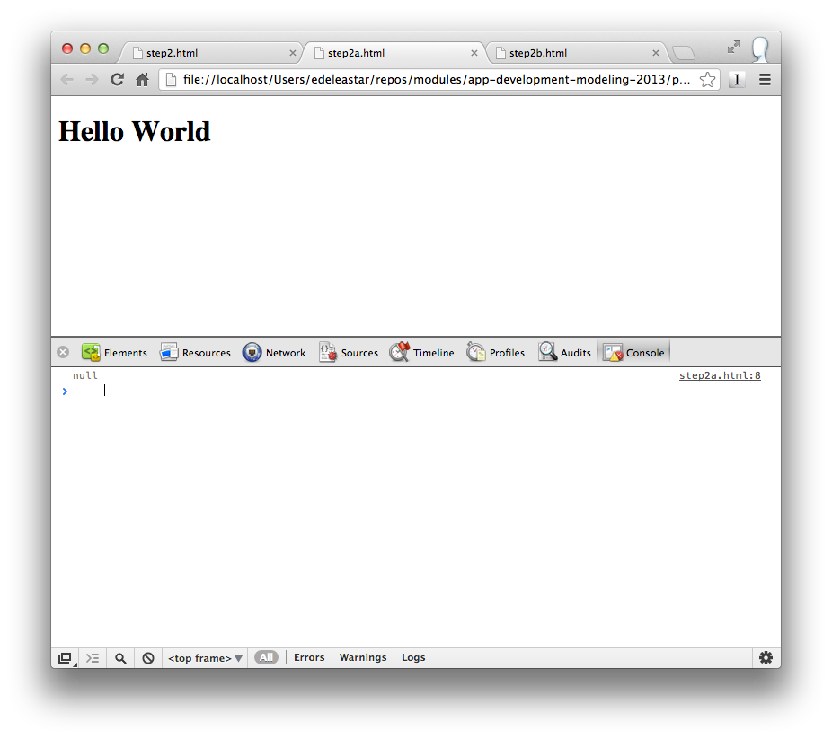

#Running Code

### External

The first and recommended option is to write code in an external file (with a ".js" extension), which can then be included on our web page using an HTML `<script>` tag and pointing the `src` attribute to the file's location. Having JavaScript in a separate file will reduce code duplication if you want to reuse it on other pages. It will also allow the browser to cache the file on the remote client's computer, decreasing page load time.

```html
<!--Code is written in a .js file, then included via the script tag src attribute.-->
<script src="/path/to/example.js"></script>
```

### Inline

The second option is to inline the code directly on the web page. This is also achieved using HTML `<script>` tags, but instead of pointing the `src` attribute to a file, the code is placed between the tags. While there are use cases for this option, the majority of the time it is best to keep our code in an external file as described above.

```html
<!--Embed code directly on a web page using script tags.-->
<script>
  alert("Hello World!");
</script>
```

### Attributes

The last option is to use the event handler attributes of HTML elements. This method is strongly discouraged:

```html
<!--Inline code directly on HTML elements being clicked.-->
<a href="javascript:alert(&#34;Hello World!&#34;);">Click Me!</a>
<button onClick="alert(&#34;Good Bye World&#34;);">Click Me Too!</a>
```
See [here](http://stackoverflow.com/questions/6941483/onclick-vs-event-handler) and [here](http://stackoverflow.com/questions/5127037/disappearing-google-map/) for discussions on reasons why not.

### Placement

Placement of the previous two options is important and can vary depending on the situation. If you are including JavaScript that doesn't access the elements on the page, you can safely place the script before the closing HTML `<head>` tag. However, if the code will interact with the elements on the page, you have to make sure those elements exist at the time the script is executed. This common pitfall can be seen in the example below. The script for finding the element with the ID "hello-world" will be executed before the element is defined in the document.

```html
<!--Attempting to access an element too early will have unexpected results.-->
<!DOCTYPE html>
<head>
  <script>

    const title = document.getElementById("hello-world");
    console.log(title);

  </script>
</head>
<body>
<h1 id="hello-world">Hello World</h1>
</body>
</html>
```

It is a common pattern to move scripts to the bottom of the page, prior to the closing HTML `<body>` tag. This will guarantee that elements are defined when the script is executed.


```html
<!--Moving the script to the bottom of the page will make sure the element exists.-->
<!doctype html>
<html>
<head>
</head>
<body>
  <h1 id="hello-world">Hello World</h1>
  <script>

      const title = document.getElementById("hello-world");
      console.log( title );

  </script>
</body>
</html>
```


##Exercise

Incorporate the last two html documents into two html file in your js-labs-1 project:

- step1a.html
- step2b.html

Open both files in the google Chrome browser. Show the developer tools, and examine the console:

###step1a.html



###step1b.html


Note the difference. Can you see the reason?

###2.2 Influence of HTML5 script attribute *defer*

Replace the code in step-1.html with that below. Observe the changes we have introduced.
```
<!DOCTYPE html>
<head>
  <meta charset="UTF-8">
  <title>step-1</title>
  <script src="step-1.js" defer></script>
</head>
<body>
<h1 id="hello-world">Hello World</h1>
</body>
</html>
```
Create the referenced JavaScript file.

```
// step-1.js
let title = document.getElementById('hello-world');
console.log(title);
```
Open step-1.html in Chrome and note the output in the console.

The refactored project is shown in Figure 3.

Delete the *defer* attribute and refresh the html file.
```
  <script src="step-1.js"></script>

```
Compare the two outputs. 

Study this [defer attribute documentation](http://reference.sitepoint.com/html/script/defer) documentation.

- What is the effect of including the *defer* attribute?
- What restrictions if any apply to the use of the *defer* attribute?


## JSCS

You should have downloaded `.jscsrc file in step one:

- [Customized JSCS config file archive](archive/jscsrc.zip)

You should now place the '.jscsrc' file from the archive into your project. It will immediately try to validate the `step-1.js` source file. You should try to ensure that there are not violations in the file - such that the jscsrc is giving you a clean bill of health.


###2.3 DOM Access

Introduce some more html elements into the page. By copying the code in the example, see if you can log these elements to the console 


