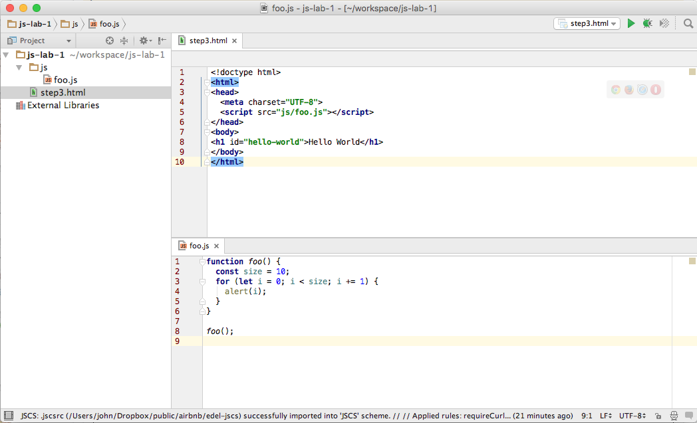
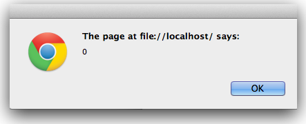
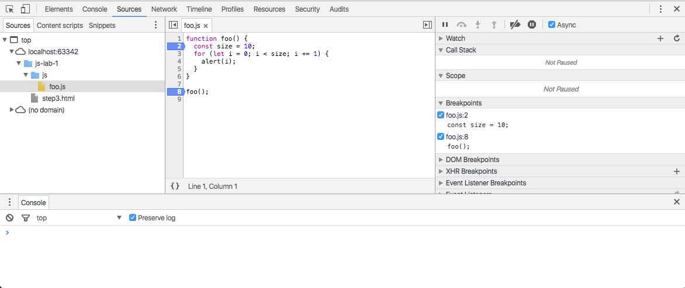
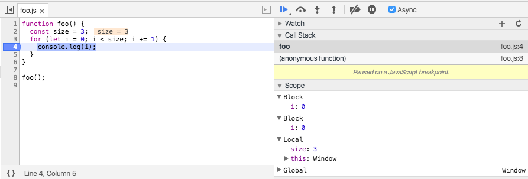
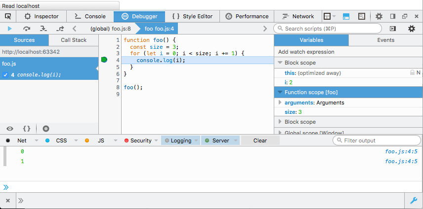
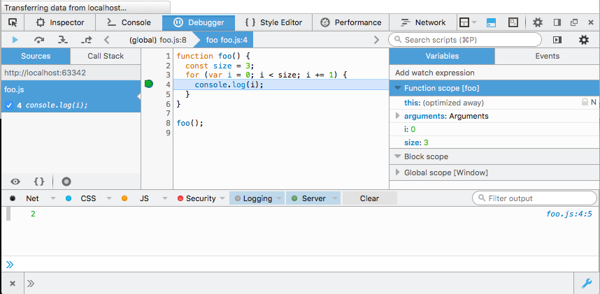

#Syntax Basics

### Comments

JavaScript has support for single and multi-line comments. Comments are ignored by the JavaScript engine and therefore have no side-effects on the outcome of the program. Use comments to document the code for other developers. Libraries like [JSDoc](http://code.google.com/p/jsdoc-toolkit/, "JSDoc Toolkit") are available to help generate project documentation pages based on commenting conventions.

Refer to [Airbnb JavaScript Style Guide rules on comments](http://airbnb.io/javascript/#comments) for detailed information.

####Single line comment
```javascript

// This is an example of a single line comment.
```

####Multi line comment
```
/*
 * this is an example
 * of a
 * multi line
 * comment.
 */
```

### Whitespace

Whitespace is also ignored in JavaScript. There are many tools that will strip out all the whitespace in a program, reducing the overall file size and improving network latency. Given the availability of tools like these, whitespace should be leveraged to make the code as readible as possible.

Refer to [Airbnb JavaScript Style Guide rules on whitespace](http://airbnb.io/javascript/#whitespace) for detailed information.

```javascript
// Whitespace is insignificant.
const hello = "Hello";

const world     =      "World!";
```

```
/**
 * Semantic whitespace promotes readibility.
 * Readible code is good!
 */
function foo() {
  const size = 10;
  for (let i = 0; i < size; i += 1) {
    alert(i);
  }
}

foo();

// This is much harder to read!
const foo=function() {for(let i=0;i<10;++){alert(i);}};foo();
```

### Reserved Words

There is a list of reserved words that may not be used when declaring user-defined variables and functions. Some of these reserved words are currently implemented, some are saved for future use, and others are reserved for historical reasons. A list of words and in-depth explanations for each can be found on the [MDN JavaScript Reference](https://developer.mozilla.org/en-US/docs/Web/JavaScript/Reference/Lexical_grammar)

### Identifiers

Identifiers are used to give variables and functions a unique name so they can subsequently be referred to by that name. The name of an identifier must follow a few rules:

* Cannot be a reserved word.
* Can only be composed of letters, numbers, dollar signs, and underscores.
* The first character cannot be a number.

its a best practice to name identifers in a way that will make sense to you and other developers later on.

The styleguide applicable to this series of labs requires that all [identifiers must be camel case or upper case](http://airbnb.io/javascript/#variables).

Note that jQuery identifiers should be prefixed with a **$** as shown, for example, in the last variable below.

```
// Valid identifier names.
const myAwesomeVariable = 'a';
const myAwesomeVariable2 = 'b';
const MY_AWESOME_VARIABLE = 'C';
const $myAwesomeVariable = 'd';

```

##Exercises

###3.1: Comments

For the javascript code you introduced in the previous step, experiment with commenting out different sections. Get used to commenting out single lines, or entire sections. Make sure you test that the commented out sections are actually not executed. i.e., open the files in Chrome and inspect the console. While the files are open in Chrome, make an change to the file in WebStorm, get used to reloading the already open pages in Chrome.

###3.2: Running JavaScript Programs

Create a new file in the js-labs-1 project called 'step3.html'. Replace its contents with the following:

~~~html
<!doctype html>
<html>
<head>
  <meta charset="UTF-8">
  <script src="js/foo.js"></script>
</head>
  <body>
    <h1 id="hello-world">Hello World</h1>
  </body>
</html>
~~~

Now create a new folder in the js-lab-1 project called 'js'. Create an empty file in this folder called 'foo.js'. 


Edit the 'foo.js' file, and paste in the following:

~~~
function foo() {
  const size = 10;
  for (let i = 0; i < size; i += 1) {
    alert(i);
  }
}

foo();
~~~

Your project should look like this:



Now open the step3.html file in Chrome. As you open the page you see the alert dialog appearing (10 times):



Once you have clicked through these - open the developer tools again - and select "Sources" and locate and display the foo.js file:



Back in WebStorm, change the code to output the loop variable value to the console three times. Reload the page and verify this works as expected.


###3.2: Debugging JavaScript Programs using Google Chrome browser developer tools

In Chrome Sources view, click on margin alongside the alert line - this should place a marker as shown:


Reload the page again - reload the page. This time the behaviour will be a little different:



Now the javascript program is paused - because the marker we set down above is a 'breakpoint'. This means the programs is waiting your command to resume. Look closely at the panel on the bottom right:


Hover on the 5 buttons along the top for a few seconds each - and read the tooltip. Experiment with each one in turn and see if you can figure out its behaviour.

In particular, experiment with the 'step over..' and 'step into...' buttons. Monitor the "Scope Variables" panel while you are doing this:


and note the changes to the value of i.

###3.3: Debugging JavaScript Programs using Firefox web developer tools

Set the JavaScript foo.js content to be the following:

```
function foo() {
  const size = 3;
  for (let i = 0; i < size; i += 1) {
    console.log(i);
  }
}

foo();

```

For convenience we have reduced the loop size to 3 and directed output to the console rather than to a pop-up alert box.

Open step3.html in Firefox and access the developer tools using any of the following techniques:

- List of hotkeys for Windows, OSX and Linux operating systems is available [here](https://developer.mozilla.org/en-US/docs/Tools/Keyboard_shortcuts).
- Click on the wrench icon in the bottom right of the browser screen. This may be used as an open-shut toggle.
- Click on the menu item on the top right hand corner of the browser which exposes the wrench icon.

Study the Variables pane on the right of Figure 9. In particular observe that the variable **i** has block scope.



Now change foo.js by altering the type of the loop variable from let to var:

```
function foo() {
  const size = 3;
  for (var i = 0; i < size; i += 1) {
    console.log(i);
  }
}

foo();

```
Refresh Firefox and observe how the contents of the Variables pane have changed. This is shown in Figure 9. 

In particular, notice that the variable **i** now has function scope.




