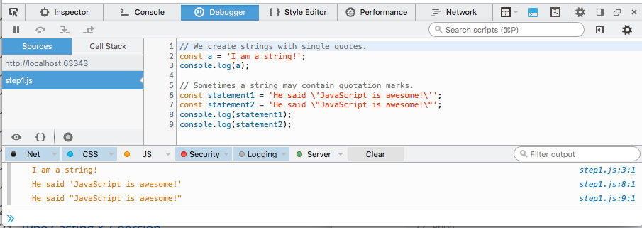
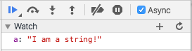

#Types

Types in JavaScript fall into two categories: primitives or objects. Primitive types include:

* String
* Number
* Boolean
* Null
* Undefined

### String

Strings are text wrapped in single or double quotation marks. 

- It is best practice to consistently use one or the other.
- In this course we use single quotes exclusively. 

There may be times when the string contains quotation marks that collide with the ones used to create the string. In this case, either escape the characters using a `\` backslash or use different quotes around the string.

```javascript
// We create strings with single quotes.

const a = 'I am a string!';
console.log(a);


```

```javascript
// Sometimes a string may contain quotation marks.

const statement1 = 'He said \'JavaScript is awesome!\'';
const statement2 = 'He said \"JavaScript is awesome!\"';
console.log(statement1);
console.log(statement2);
```


##Exercise: Strings & Objects

Create a new File called 'step4.html' in your current project, and incorporate the following :

~~~html
<!DOCTYPE html>
<html>
<head>
  <meta charset="UTF-8">
  <title>Types</title>
  <script src="js/types.js"></script>
</head>
<body>

<h1 id="Hello Types">Hello World</h1>

</body>
</html>
~~~

Note the src attribute in the script tag:

- create a corresponding javascript file called types.js in your project


Into types.js paste the following JavaScript code:

~~~javascript
// We use single quotes in creating strings.

const a = 'I am a string!';
console.log(a);

const person1 = {};

person1.firstName = 'John';
person1.lastName = 'Doe';

console.log(person1.firstName + ' ' + person1.lastName);
~~~

Now open the step4.html file in Chrome, place a breakpoint and step through the program.


Single step through the lines and observe.

The "Scope Variables" view displays the variables a and person1 as shown in Figure 3. 

It is also possible to add variables to the Watch window as shown in Figure 4.


Enter the name of a variable - 'a' in this instance - and press return:



Experiment with the debug buttons - particularly the 'Step over' and 'Step into' buttons. 

See if you can monitor the 'person1' object - you should be able to view its contents something like this:


You can restart the 'program' at any stage by reloading the page in Chrome.

### Number

Number types are any positive or negative numeric value. There is no distinction between integer and floating point values.

```javascript
// Numbers are any whole or floating point integer.
const num1 = 100;
const num2 = 100.10;
const num3 = 0.10;
```

### Boolean
Boolean types are either true or false.

```javascript
// Boolean values.
const okay = true;
const fail = false;
```

### Null and Undefined

Null and undefined are special types in JavaScript. Null types are a value that represent the absence of a value, similar to many other programming languages. Undefined types represent a state in which no value has been assigned at all. This type is created in two ways: by using the undefined keyword or by not defining a value at all.

```javascript
// Two ways to achieve an undefined value.
const foo = null;

const bar1 = undefined;
const bar2;
```

Note, in the above your webstorm jscsrc style enforcer will flag the last statement as a violation of its guidelines.

##Exercise: Numbers, Null and Undefined

Bring in the fragments above and single step through the code as we have been doing. See if you can 'watch' each of the new variables. At the the end of the script your 'watch expressions' view could look like this:


If you reload the page and break at the very first line, then the watch expressions will look like this:


Step through the program again and observe the variables change from undefined as values are assigned.


