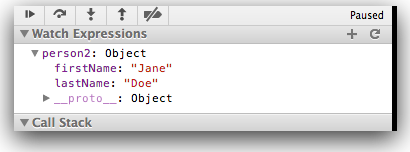

#Objects & Arrays

Everything else is in JavaScript is considered an Object. While there are [numerous built-in objects](https://developer.mozilla.org/en/JavaScript/Reference#Global_Objects, "MDN - Global Object Reference"), here we focus on:

* Object
* Array
* Function

The simplest way to create an object is either through the Object constructor or the shorthand syntax known as object literal. 

- We restrict ourselves to the use of literals. The Airbnb style guide prohibits use of the new operator.

These simple objects are unordered key/value pairs. The key is formally known as a property and the value can be any valid JavaScript type, even another object. To create or access a property on an object, we use what is known as "dot notation" or "bracket notation."

```
// Creating an object with the object literal syntax:
const person1 = {
  firstName: 'Jane',
  lastName: 'Doe',
};

console.log(person1.firstName + ' ' + person1.lastName);

```

```
// As mentioned, objects can also have objects as a property.
const people = {};

people['person1'] = person1;
people['person2'] = person2;

console.log( people['person1'].firstName );
console.log( people['person2'].firstName );
```

If a property is accessed that has not been defined, it will return a type of undefined.

```
// Properties that have not been created are undefined.
const person = { name: 'John Doe' };

console.log( person.email ); // => undefined
```

Objects are covered further in the later in more detail.


##Exercise: objects.js

Create a new file called `objects.js` containing:

~~~javascript
// Creating an object with the object literal syntax:
const person2 = {
  firstName: 'Jane',
  lastName: 'Doe',
};

console.log(person2.firstName + ' ' + person2.lastName);

~~~

Set a breakpoint on the console.log line and reload the page such that it halts here. Observe the 'Watch' panel:


It is 'polluted' with the variable we were observing in the last step. 

- In general, unwanted watch variable may be removed by clicking just to the right of the variable name on the minus sign as depicted in Figure 1. 


Now add and observe 'person2':




Now append the following code to the above:

~~~javascript

const person1 = {};

person1.firstName = 'John';
person1.lastName = 'Doe';

// As mentioned, objects can also have objects as a property.
const people = {};

people.person1 = person1;
people.person2 = person2;

console.log(people.person1.firstName);
console.log(people.person2.firstName);

~~~

In particular, see if you can explore the people object in the Watch Expression panel:


### Array

Arrays are a type of object that are ordered by the index of each item it contains. The index starts at zero and extends to however many items have been added, which is a property of the array known as the "length" of the array. Similar to a basic object, an array can be created with the array constructor or the shorthand syntax known as array literal.

```
// Creating an array with the constructor:
const foo = new Array; // we do not use this style

// Creating an array with the array literal syntax:
const bar = []; // this style complies with Airbnb style guide
```

There is an important distinction to be made between the two. Both an array construnctor and an array literal can contain items to be added to the array upon creating it. However, if just a single numeric item is passed in, the array constructor will assume its length to be that value.

```
// The array literal returns a bar.length value of 1:
const foo = [100];

// => 100
console.log( foo[0] );
// => 1
console.log( foo.length );

// The array constructor returns a bar.length value of 100:
const bar = new Array(100);
// => undefined
console.log(bar[0]);
// => 100
console.log(bar.length);
```

An array can be manipulated through methods that are available on the instance of the array. 

- Items in the array can be accessed using bracket notation enclosing an index.
- If the index does not exist or contains no value, the return type will be undefined. 

A few common array methods are shown below:

```
// Using the push(), pop(), unshift() and shift() methods on an array
const foo = [];

foo.push('a');
foo.push('b');

console.log(foo[0]); // => a
console.log(foo[1]); // => b

console.log(foo.length); // => 2

foo.pop();

console.log(foo[0]); // => a
console.log(foo[1]); // => undefined

console.log(foo.length); // => 1

foo.unshift('z');

console.log(foo[0]); // => z
console.log(foo[1]); // => a

console.log(foo.length); // => 2

foo.shift();

console.log(foo[0]); // => a
console.log(foo[1]); // => undefined

console.log(foo.length); // => 1

```

There are many more methods for manipulating arrays, some of which are covered further in the [Arrays](/arrays) section. Details can be found on the [Mozilla Developer Network](https://developer.mozilla.org/en/JavaScript/Reference/Global_Objects/Array "MDN - Array Reference").

##Exercise: Arrays

Create a html-javascript file pair. The code follows:

- step6.html
- js/arrays.js

```
<!DOCTYPE html>
<html>
<head>
  <meta charset="UTF-8">
  <title>Arrays</title>
  <script src="js/arrays.js"></script>
</head>
<body>

<h1 id="Hello Arrays">Hello Arrays</h1>

</body>
</html>
```

```
// Using the push(), pop(), unshift() and shift() methods on an array
const foo = [];

foo.push('a');
foo.push('b');

console.log(foo[0]); // => a
console.log(foo[1]); // => b

console.log(foo.length); // => 2

foo.pop();

console.log(foo[0]); // => a
console.log(foo[1]); // => undefined

console.log(foo.length); // => 1

foo.unshift('z');

console.log(foo[0]); // => z
console.log(foo[1]); // => a

console.log(foo.length); // => 2

foo.shift();

console.log(foo[0]); // => a
console.log(foo[1]); // => undefined

console.log(foo.length); // => 1

```
Comment out all of the code using the multi-line comment

~~~javascript
/*
 ...
*/
~~~

Incorporate some of the array examples above and single step though them. Carefully explore the arrays in the "Watch Expressions" panel.
Note the appearance of an array in that panel:


Contrast it with how an object looked earlier:


Can you see how similar they are?


