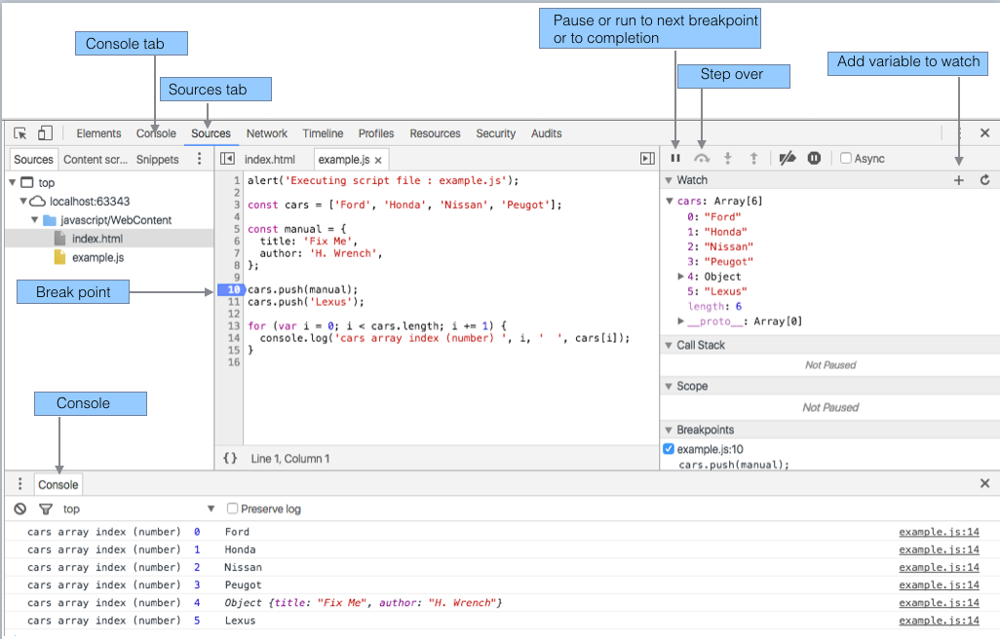

#Selected debug features

The following summarizes some of the frequently used features in the developer tools pane:

- Sources pane
    - This pane is shown in Figure 1 below.
    - It allows one to view both the html and script files (JavaScript).

- Break points
    - Break points may be positioned as shown. This feature is quite similar to that already encountered in debugging Java in Eclipse.
    - To set a breakpoint simply click on the line number. 
    - To remove a breakpoint click on it.

- Pause | Run
    - Execution pauses at a breakpoint. Pressing this button causes the execution to resume and continue to the next breakpoint or to the end of ths script if no further breakpoints present.

- Step over
    - Allows one to execute the code manually line by line.

- Watch variable
    - One may add a variable here and observe its value.

- Console pane
    - The output from *control.log* is viewable in the Console pane
    - The output generated by *example.js* is shown in Figure 2 here.

