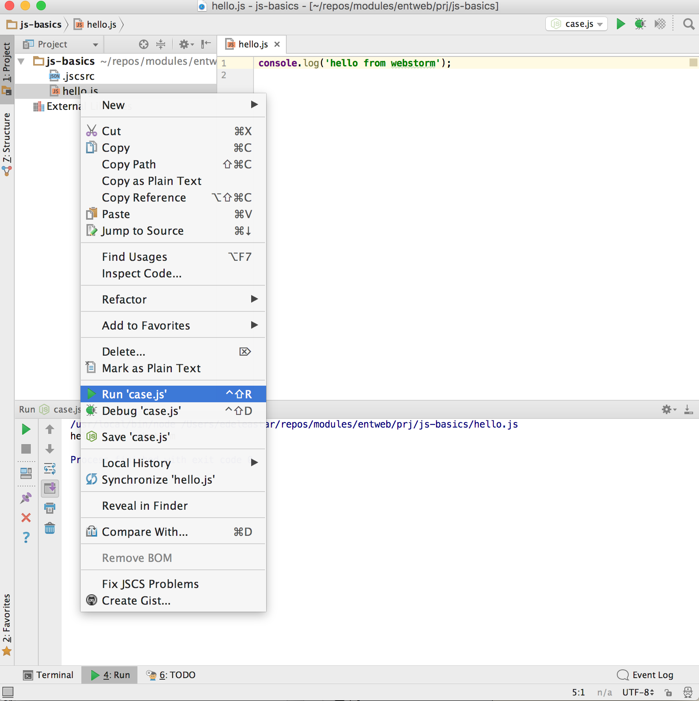

# Setup

For this lab, we will dispense with the need for html and a browser to run the code, and make use of webstorm (and node) to run the programmes.

Create a new empty project called `js-basics`.  Follow the instructions on the first step of the last lab to configure the project with the same .jscsrc configuration as outlined there.

In the project, create a file called `hello.js` containing the following:

~~~
console.log('hello from webstorm');

~~~

You can now run this script by selecting the file in the context menu, and selecting `Run`:

We should see the message in the lower run panel. We can use this technique to run all the scripts in this lab.