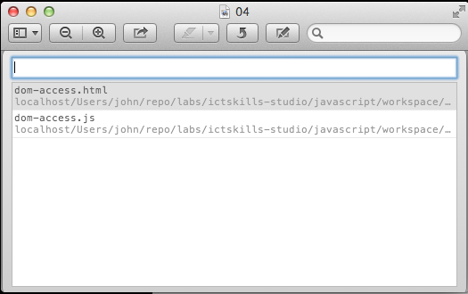
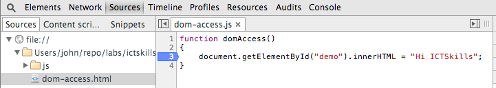

#index1.html / dom-manip-1.js

In Webstorm, create new empty project called jquery-intro. Bring in the `.jscsrc` file as in the previous labs, and make sure the code inspections are enabled.

Introduce this file 

##index1.html
~~~
<!DOCTYPE html>
<!DOCTYPE html>
<html>
  <head>
    <title> JQuery Experiments </title>
  </head>
  <body>
    
Click the button to change this text.

    <button onclick="domAccess()">Try it</button>
    
    
  </body>
</html>
~~~

Add the following file to the project (in the `js` subdirectory):

## dom-manip-1.js

~~~
function domAccess() {
  document.getElementById('demo').innerHTML = 'Hi ICTSkills';
}
~~~
Open *dom-access.html* in Chrome browser.

- You should be presented with something similar to that depicted in Figure 1.

- Click the button *Try it*.
    - The  text *Click the button to change this text* should be replaced with:
    - Hi ICTSkills (Figure 2).

Let's use Google Chrome debugger to better understand what's happening:

- Open *dom-access.html* in Chrome.
- Select *Tools | Developer Tools* in the context menu: see Figugre 3.

- Select the file *dom-access.js* into the text window (see Figure 4).

- The file *dom-access.js* should now be visible as shown in Figure 5.

Place a breakpoint on line 3, the statement *document.getElementById("demo").innerHTML = "Hi ICTSkills";*

- You may do this by simply placing the mouse pointer on the number 3 and clicking. See Figure 6.

- Reload the page and press the button **Try it**
    - As shown in Figure 7, the program stops at line 3, the breakpoint.

How does this happen?

- When, during the loading of the page described in the file *dom-access.html*, the statement `
    
  </body>
</html>
~~~

Study the jQuery syntax.

- $("#demo").html("Hi ICTSkills");
    - \#demo refers to the *id* in the html paragraph node
        - Observe that a hash (\#) is prepended to the id as shown in the html file.
    - $("#demo") is a jQuery object
    - $("#demo").html(...): here a jQuery method *html(...)* is being invoked on the jQuery object.
        - The text parameter in *html(...)* replaces the existing text at the location identified by the id *\#demo*.
