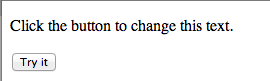

#index2.html / dom-manip-2.js

In this step we shall use both native JavaScript and jQuery to obtain information on a single DOM element using the element's *id* attribute.

-Recall that an **id** uniquely identifies an element on a page.

Download the [img.zip](archive/img.zip) from the local archive, expand and place the folder *img* in your *WebContent* folder.

- The folder *img* contains three arbitrarily chosen png images, 01, 02 and 03.
- Create a file domManip.html in WebContent and add the following content:

## index2.html

~~~
<!DOCTYPE html>
<html>
  <head>
    <title> JQuery Image Experiments </title>
  </head>
  <body>
    

      <h2>Image 1</h2>
      

    

      <h2>Image 2</h2>
      
    

    

      <h2>Image 3</h2>
      
    

    
    
  </body>
</html>

~~~

Create file *dom-manip-2.js* in the folder *js* and add this content:

## dom-manip-2.js

~~~
const image = document.getElementById('img1'); 
alert('Image height is '' + image.height);  
~~~

Open *domManip.html* in Chrome. An alert box should open as shown in Figure 1.

Let's now use a jQuery function call to obtain the image height.

Replace the *dom-manip-2.js* content with:

~~~
const image = $('#img1');
alert('Image height is ' + image.height());  
~~~
Alternatively use a more compact version:

~~~
alert('Image height is ' + $('#img1').height());
~~~
