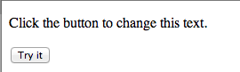
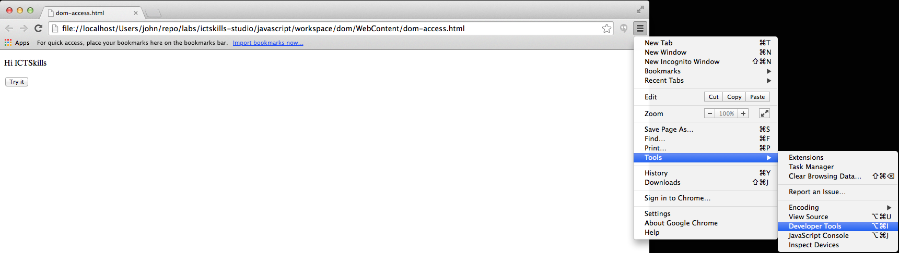
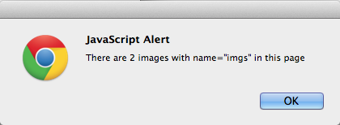

#index3.html / dom-manip-3.js

Recall that whereas an **id** uniquely identifies an element on a page, a **name** may be repeated.

- In this step we shall obtain information about an array of elements identified by their *name* attribute.

Modify the file a new file index3.html which differs from the previous version:

- add a name attribute to images 1 and 2
    - *name="imgs"*
    - the third image shall remain nameless.

The object is to retrieve an array of elements comprising those whose name attribute is "imgs".
    
- We expect, therefore, that the array shall contain two images.

Here is a new html file for the project:

## index3.html

~~~
<!DOCTYPE html>
<html>
  <head>
    <title> More Query Image Experiments </title>
  </head>
  <body>
    

      <h2>Image 1</h2>
      
    

    

      <h2>Image 2</h2>
      
    

    

      <h2>Image 3</h2>
      
    

    
    
  </body>
</html>
~~~

And here is the corresponding JavaScript:

##dom-manip-3.js

~~~
const images = document.getElementsByName('imgs');
for (let i = 0; i < images.length; i++) {
  alert('Image number ' + i + ' is ' + images[i].height);
}
~~~

Open (or reload) *index2.html*.

- Two alert boxes should open in succession, each stating the image number and its height.
    - Note that there are three images on the page but that, as expected, we obtain information on only two, those whose name is *imgs*.

To use jQuery to the same effect replace the content of *domManip.js* with:

## dom-manip-3.js

~~~
const $images = $('[name="imgs"]');
alert('There are ' + $images.length + ' images with name="imgs" in this page');
let index = 0;
$images.each(function () {
  alert('Image ' + index + ' height is ' + $(this).height());
  index += 1;
});
~~~

We have included an extra statement here to indicate the number of images with *name=\"imgs\".

- alert("There are "+ images.length +" images with name="imgs" in this page");

Note the jQuery syntax to reference the **name** attribute.
    
- $('[name="imgs"]')

Recall the syntax to reference **id**

- $("#img1")