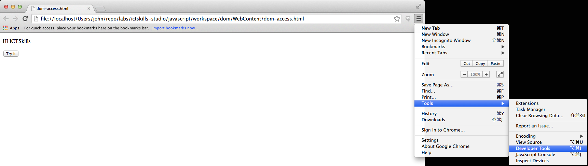

#index4.html / dom-manip-4.js

In this step we shall retrieve nodes using the native JavaScript method *getElementsByTagName* and its jQuery equivalent.

The method *getElementsByTagName* differs from the methods *getElementById* and *getElementsByName* in that it can be invoked on any node, not just the *document* root node as is the case with the latter two methods.

There are two parts to this step.

- In part 1 we shall retrieve an array of all the images in a web page and print the size of the array in an alert box.
- In part 2 we shall retrieve an array only of those images in the div node whose id is "ictskills-imgs".

**Preparation**

- Download the [img2.zip](archive/img2.zip) from the local archive, expand and copy the three png images (04, 05,06) to the img folder in WebContent.
    - There will then be six images in the *img* folder.

Add a new html file:

## index4.html

~~~
<!DOCTYPE html>
<html>
<head>
<meta charset="UTF-8">
<title>Insert title here</title>
</head>
<body>

  

      

        <h2>Image 1</h2>
        
      

      

        <h2>Image 2</h2>
        
      

      

        <h2>Image 3</h2>
        
      

    

    

      

        <h2>Image 4</h2>
        
      

      

        <h2>Image 5</h2>
        
      

      

        <h2>Image 6</h2>
        
      

    

    
    
</body>
</html>
~~~
Study the changes:

- We have added 3 extra images.
- The original 3 images are wrapped in a div with id *ictskills-imgs*.
- The new images are in a div with id *computer-science-imgs*.

**Part 1**

## dom-manip-4.js

~~~
const images = document.getElementsByTagName('img');
alert('Number of images in page is ' + images.length);

~~~
Open *index4.html* in Chrome. You should be presented with an alert box as depicted in Figure 1:

To repeat using jQuery, replace the javascript file with the following:

## dom-manip-4.js

~~~
const images = $("[name='imgs']");
alert("Number of images in page is " + images.length);
~~~
Carefully note the jQuery syntax.

**Part 2**
In this part we shall count the number of images in a specific div.

The html remains unchanged.

Here is the revised javascript:

~~~
const imgDiv = document.getElementById('ictskills-imgs');
const images = imgDiv.getElementsByTagName('img');
alert('There are '+images.length+' images in this page');
~~~
Replace the content of *dom-manip-3.js* with the above code and then open *index3.html* in a browser.

You should see a JavaScript Alert box similar to that in Figure 2.

Note what's happening here:

- We retrieve the node whose id is "ictskills-imgs". 
    - This is the div defined within the html as follows:
        - `

`
- We then invoke *getElementsByTagName on this node (an object):
    - imgDiv.getElementsByTagName('img'); 
    - This allows us to determine the number of images in the node.

Here is the jQuery code.

Filename: dom-manip-4.js
~~~
const images = $('#ictskills-imgs [name="imgs"]');
alert('There are '+ images.length +' images with name "imgs" in this page');
~~~

The jQuery syntax here requires careful study.

The expression *$("[name='imgs']");* would return all images whose attribute name is *imgs*, 6 in total.

However, the expression *$("#ictskills-imgs [name='imgs']");* returns only the images within the node (the div in this case), whose id is *ictskills-imgs* AND whose attribute name is *imgs*, a total of 3.

