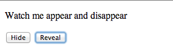

#index5.html / dom-manip-5.js

Create a file in WebContent named *index5.html* with the following content:

Filename: index5.html

~~~
<!DOCTYPE html>
<html>
  <head>
    <meta charset="UTF-8">
    <title>Hide and Reveal</title>
  </head>
  <body>
    
Watch me appear and disappear

    <button onclick="hide()">Hide</button>
    <button onclick="reveal()">Reveal</button>

    
    
  </body>
</html>
~~~

Create a corresponding JavaScript file in the *js* folder:

# dom-manip-5.js

~~~
function hide()  {
  document.getElementById("text").style.visibility = "hidden";
}
function reveal()  {
  document.getElementById("text").style.visibility = "visible";
}
~~~

Open show.html in Chrome. 

Press Hide.

Press Reveal.

Replace the content of show.js with the jQuery equivalent:

~~~
function hide() {
  $('#text').hide();
}

function reveal() {
  $('#text').show();
}
~~~
Test as before: the behaviour should be similar.

