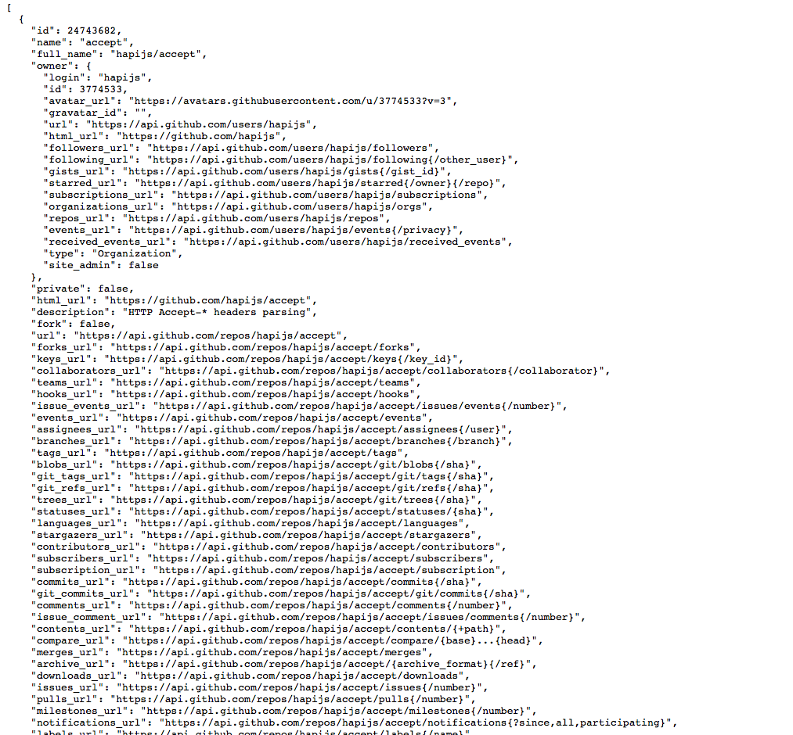

#Web Interface

Visit the following page on github:

- <https://github.com/hapijs>

You will see something like this:

Now try this url here instead:

- <https://api.github.com/users/hapijs/repos>

You might see something like this:

See if you can correlate the information on the two different views above - i.e. locate what subset is presented on the page.