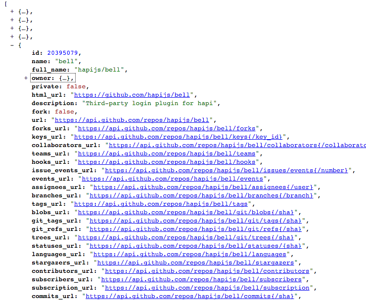

#Json

Look at this rendering of the same view here:

This is generated by using this Chrome Plugin:

- <https://github.com/gildas-lormeau/JSONView-for-Chrome>

To install it, open the above page in chrome and click in the `JSONView for Chrome` link:

Once installed in chrome, visit the api link again:

- <https://api.github.com/users/hapijs/repos>

And you should see it rendered as above.

Note that is is a 'folding' view - so you can collapse down the various sections of the document:

As well as follow any of the highlighted links.
