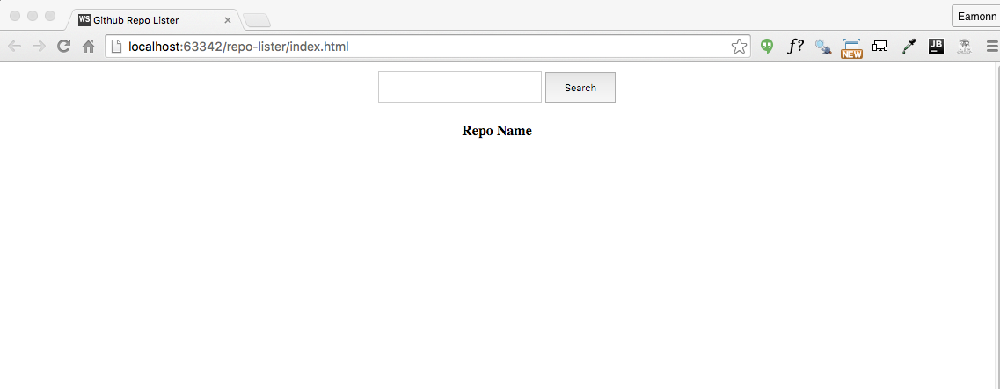

#Project Setup

Create a new `Empty Project` in Webstorm called `js-ajax-1` and create the following structure - with empty files as shown:

These are starter version of the three files:

##style.css

~~~
html {
  height: 100%;
}

body {
  height: 100%;
  margin: 0;
  padding: 0;
}

.search {
  margin-top: 10px;
  text-align: center;
}

.search-input {
  width: 180px;
  height: 30px;
}

.search-btn {
  width: 80px;
  height: 35px
}

.result {
  width: 80px;
  height: 35px;
}

.repo_table {
  margin-top: 20px;
  margin-left: auto;
  margin-right: auto;
}
~~~

##index.html

~~~
<!doctype html>
<html>

  <head>
    <title>Github Repo Lister</title>
    <link href="style.css" type="text/css" rel="stylesheet"/>
    
  </head>

  <body>
    

      <input type="text" name="username" id="username" class="search-input">
      <button id="search_btn" class="search-btn">Search</button>
        
    

    <table class="repo_table" id="repo_table">
      <thead>
        <tr>
          <th>Repo Name</th>
        </tr>
      </thead>
      <tbody>
      </tbody>
    </table>
    
  </body>

</html>
~~~

##repo-lister.js

~~~
$('#search_btn').click(function () {
  var userName = $('#username').val();
  console.log(userName);
});
~~~

Browse to `index.html` now, enter a value and press search. You can do this from within WebStorm - as the chrome icon will appear if you leave the mouse rest on the source for a second or two.

Bring in the `.jscsrc` file from th previous labs, and make sure the inspections are enabled.
