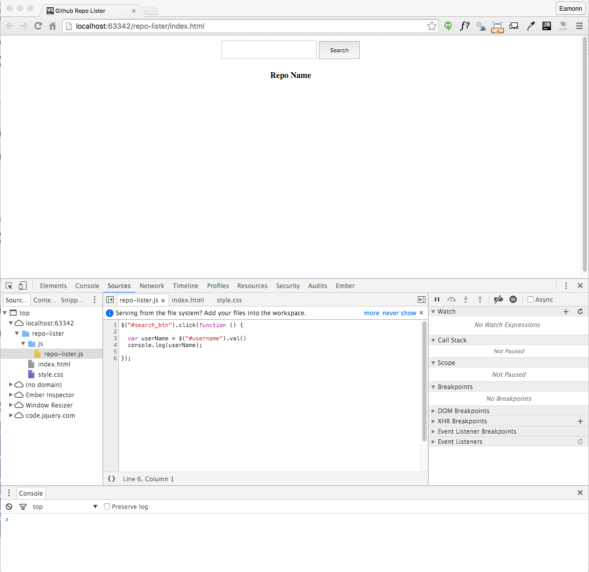
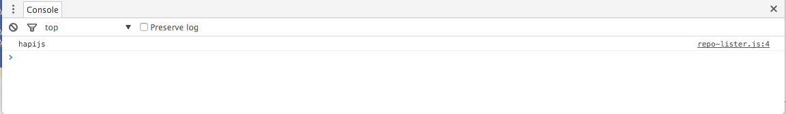
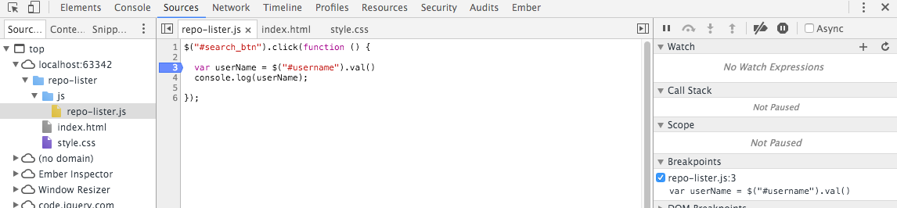
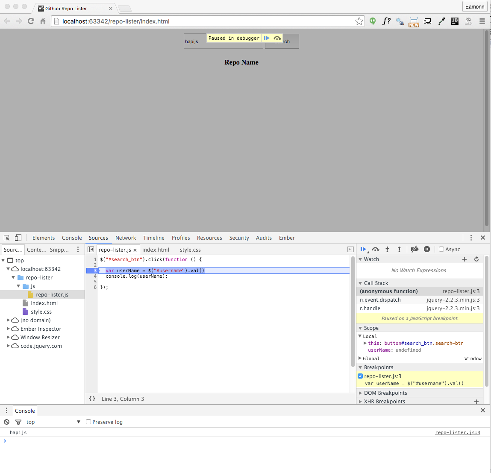
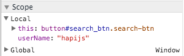
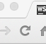

#Chrome Debugging

in Chrome, select `Customise->More Tools->Developer Tools'

Try to arrange chrome to look like this:

Now enter the string `hapijs` into the text box and press search. You should see the string echoed in the console:

In the 'report-lister.js' window - double click on line 3:

This drops a breakpoint on this line of code. Press `Search` again - this time the program will stop on this line:

This toolbar can now control the program execution:

Experiment with the various buttons - however over them will give you an idea as to what they do. The first three in particular are important:

- "Resume script execution"
- "Step over next function call"
- "Step into next function call"

Use the second button (`step over`) to advance the programe line by line. Keep a close eye in the `Scope` view on the right:

Notice how we can see the current value in the `userName` variable.

If we want to `watch` the variable (always having it in view), we can add it using the `Watch` window:

Press the `+` button and enter `userName` to watch that particular variable.

If you loose track of the execution, or if you edit the source to make a change, then you must press the browser reload button in order to restart the program execution:

