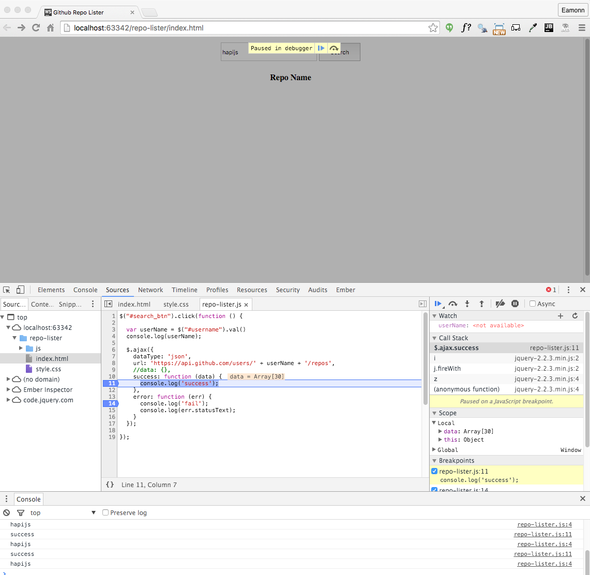
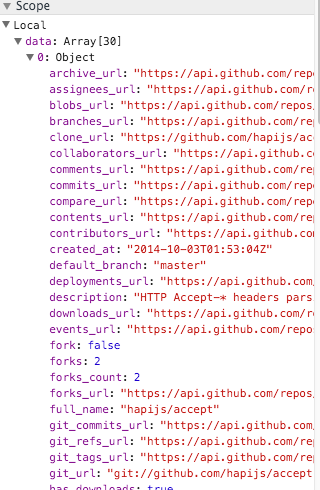
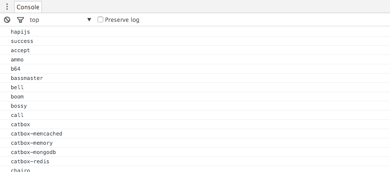

#Retrieve Repo List

Replace the current javascript event handler with the following:

~~~
$('#search_btn').click(function () {

  var userName = $('#username').val();
  console.log(userName);

  $.ajax({
    dataType: 'json',
    url: 'https://api.github.com/users/' + userName + '/repos',
    success: function (data) {
      console.log('success');
    },

    error: function (err) {
      console.log('fail');
      console.log(err.statusText);
    },

  });
});
~~~

Using the breakpoint feature of chrome, experiment with various username - both valid and invalid - and explore how the debugger responds.

In particular, for a successful request, locate and expand the `data` value:

We can extend the `success` function to list the repo names to the console:

~~~
    success: function (data) {
      console.log('success');
      for (let i = 0; i < data.length; i++) {
        console.log(data[i].name);
      }
    },
~~~

Running this should print the following to the console:

