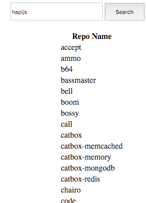

#Populating a Table

We can extend the success function to populate the html table we already have laid out:

~~~
        $('#repo_table').append('<tr><td>' + data[i].name + '</td></tr>');
~~~

Try this now - and you should see the list of repo names:

we can also display appropriate error message is no user is found.

Here is a revised version - which can replace the current version. The log statements have been removed to keep it simple - and also a `result` string is displayed with:

- number of repos if successful
- an error message is failed.

~~~
$('#search_btn').click(function () {

  var userName = $('#username').val();
  console.log(userName);

  $.ajax({
    dataType: 'json',
    url: 'https://api.github.com/users/' + userName + '/repos',
    success: function (data) {
      console.log('success');
    },

    error: function (err) {
      console.log('fail');
      console.log(err.statusText);
    },

    success: function (data) {
      $('#result-msg').text('');
      $('#result-msg').text(data.length + ' repos');
      for (let i = 0; i < data.length; i++) {
        $('#repo_table tbody').append('<tr><td>' + data[i].name + '</td></tr>');
      }
    },
  });
});

~~~