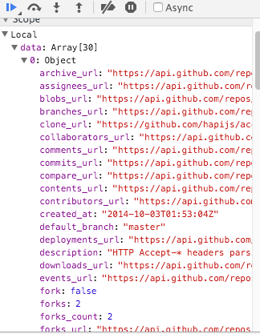

#Exercises

Project repository so far:

- <https://github.com/wit-ictskills-2016/js-ajax-1.git>

##Exercise 1:

If you load the repos for `hapjs` say, and then query for another user (your own github account say) - what happens? It looks like it still returns the `hapijs` repos. In fact, it is appended the second query on to the first. Change this so that we reset the table (emptying its contents) on every request,

##Exercise 2:

Extend the table to display additional information about each repo. 

To discover what fields are available, examine the data array in the debugger:

Or - go back to chrome view of the url:

Or - consult the github documentation directly:

- <https://developer.github.com/v3/>

In particular - the repo `Endpoint` is documented here:

- <https://developer.github.com/v3/repos>

##Exercise 3:

The url can take parameters - including the sort order. Try to have the repository sorted by 'updates' or 'created' by providing the appropriate parameter

##Exercise 4:

If you get 2 working, include a drop down next to the search button, which will allow the user to select on of the order parameters to control the sequence in which the table is populated.