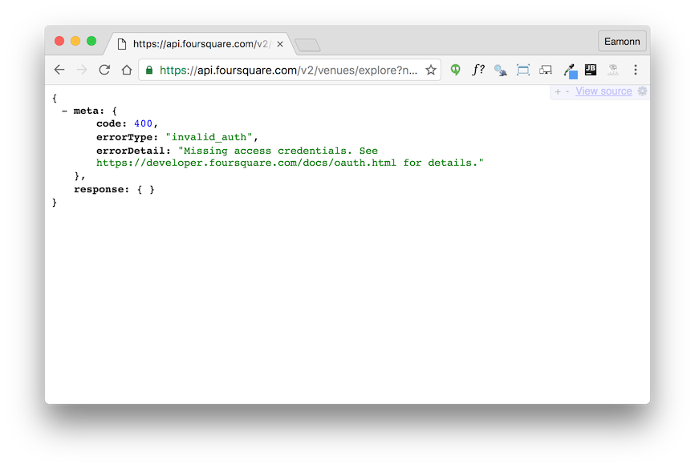

#Checkins

Visit:

- <https://foursquare.com/>

And press 'Seatch' on the waterford Location (leave the other field blank).

Now try this:

In a any text editor, perhaps sublime, insert the following:

~~~
https://api.foursquare.com/v2/venues/explore?near=Waterford,IE&query=&v=20140601
~~~

Now copy and paste this into the address bar of a browser and see what is returned. Should be something like this:

In the edtior, modify the urls to contain the id + secret you noted from the foursquare developer account:

~~~
https://api.foursquare.com/v2/venues/explore?near=Waterford,IE&query=&client_id=YOUR_ID&client_secret=YOUR_SECRET&v=20140601
~~~

Now transfer the url to an browser and you should see results:

This has been rendered with this chrome plugin:

- <https://chrome.google.com/webstore/detail/jsonview/chklaanhfefbnpoihckbnefhakgolnmc?hl=en>

Which you may already have installed.
