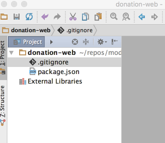

# Initial Empty Project

Make sure the latest version of node.js is installed on your workstation:

- <https://nodejs.org>

Open a command line shell in a suitable location, and enter the following commands:

~~~
mkdir donation-web
$ cd donation-web
$ npm init
~~~

The last command above: `npm init` - is a utility to create a new node module. Apart from a suitable description, you can accept the defaults for all properties:

~~~
This utility will walk you through creating a package.json file.
It only covers the most common items, and tries to guess sensible defaults.

See `npm help json` for definitive documentation on these fields
and exactly what they do.

Use `npm install <pkg> --save` afterwards to install a package and
save it as a dependency in the package.json file.

Press ^C at any time to quit.
name: (donation-web)
version: (1.0.0)
description: an application to host donations for candidates
entry point: (index.js)
test command:
git repository:
keywords:
author:
license: (ISC)
About to write to /Users/edeleastar/repos/modules/web-2/web-app-2016/prj/donation-web/package.json:

{
  "name": "donation-web",
  "version": "1.0.0",
  "description": "an application to host donations for candidates",
  "main": "index.js",
  "scripts": {
    "test": "echo \"Error: no test specified\" && exit 1"
  },
  "author": "",
  "license": "ISC"
}

Is this ok? (yes) yes
~~~

When completed, the utility will have generated the following file:

##package.json

~~~
{
  "name": "donation-web",
  "version": "1.0.0",
  "description": "an application to host donations for candidates",
  "main": "index.js",
  "scripts": {
    "test": "echo \"Error: no test specified\" && exit 1"
  },
  "author": "",
  "license": "ISC"
}
~~~

If you are commiting the application to git, then you should create this .gitignore file:

##.gitignore

~~~
.idea
node_modules
~~~

If you are using webstorm, then opening the project it should look like this now:

##Webstorm

