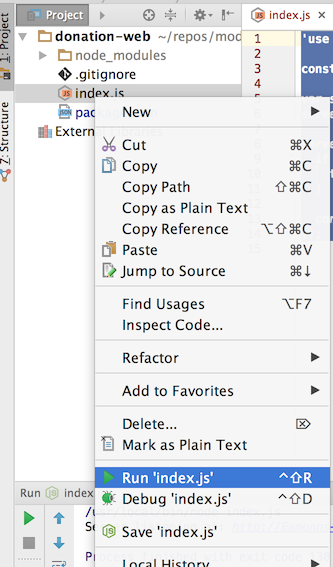
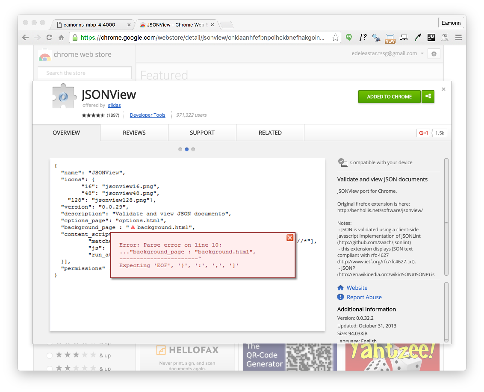

# First Simple HAPI Server

Using the same command line shell (inside the `donation-web` folder), enter the following command:

~~~
npm install hapi -save
~~~

When complete, npm will enumerate the module we have just installed:

~~~
donation-web@1.0.0 /Users/edeleastar/repos/modules/web-2/web-app-2016/prj/donation-web
└─┬ hapi@14.1.0
  ├── accept@2.1.2
  ├── ammo@2.0.2
  ├── boom@3.2.2
  ├── call@3.0.3
  ├── catbox@7.1.2
  ├── catbox-memory@2.0.3
  ├── cryptiles@3.0.2
  ├── heavy@4.0.2
  ├── hoek@4.0.2
  ├── iron@4.0.2
  ├── items@2.1.1
  ├─┬ joi@9.0.4
  │ ├── isemail@2.2.1
  │ └── moment@2.14.1
  ├── kilt@2.0.2
  ├─┬ mimos@3.0.3
  │ └── mime-db@1.23.0
  ├── peekaboo@2.0.2
  ├── shot@3.1.1
  ├── statehood@4.0.3
  ├─┬ subtext@4.0.5
  │ ├── content@3.0.2
  │ ├─┬ pez@2.1.2
  │ │ ├── b64@3.0.2
  │ │ └─┬ nigel@2.0.2
  │ │   └── vise@2.0.2
  │ └── wreck@8.0.1
  └── topo@2.0.2
~~~

These modules will be visible in the `node_modules` folder.index. 

Also, notice that the `package.json` file will be extended to include a new dependency:

~~~
...
  "dependencies": {
    "hapi": "^14.1.0"
  }
...
~~~

Create the following file in your project:

##index.js
~~~
'use strict';

const Hapi = require('hapi');

var server = new Hapi.Server();
server.connection({ port: process.env.PORT || 4000 });

server.start(err => {
  if (err) {
    throw err;
  }

  console.log('Server listening at:', server.info.uri);
});
~~~

In Webstorm, we should be able to run the application via the context menus:

The application is being served on port 4000 on localhost:

- <http://localhost:4000>

Your browser may not present the response as neatly as above. Here we are using Chrome + a plugin called JSONView.

Install this into your version of chrome now - and it will automatically present a tidier view of any JSON that happens to be returned from an app.

