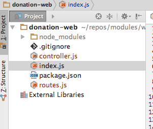

# First Route + Controller

Create the following two file in the project:

##controller.js

~~~
exports.index = {

  handler: function (request, reply) {
    reply('Hello!');
  }

};
~~~

##routes.js

~~~
const Controller = require('./controller.js');

module.exports = [

  { method: 'GET', path: '/', config: Controller.index },

];
~~~

The project will now look like this in Webstorm:

##index.js

Now modify `index.js` to load the route:

~~~
server.route(require('./routes'));
~~~

This is placed just before the server is started:

~~~
'use strict';

const Hapi = require('hapi');

var server = new Hapi.Server();
server.connection({ port: process.env.PORT || 4000 });

server.route(require('./routes'));

server.start(err => {
  if (err) {
    throw err;
  }

  console.log('Server listening at:', server.info.uri);
});
~~~

Run the application again (restart it if already running) - and browse to:

- <http://localhost:4000>

You should see a simple greeting.
