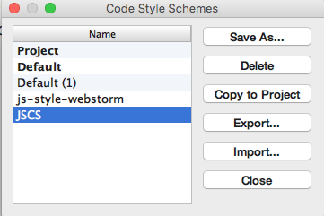
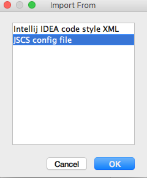
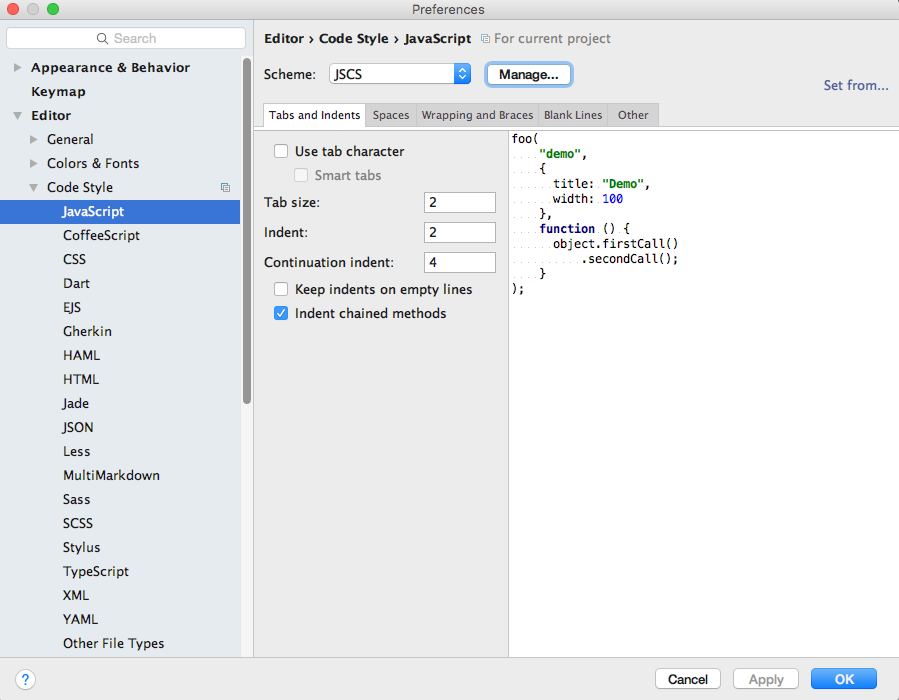
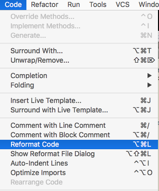
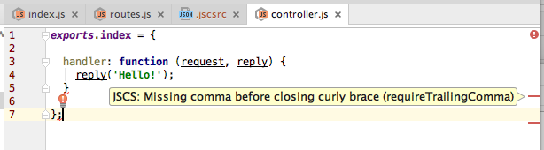
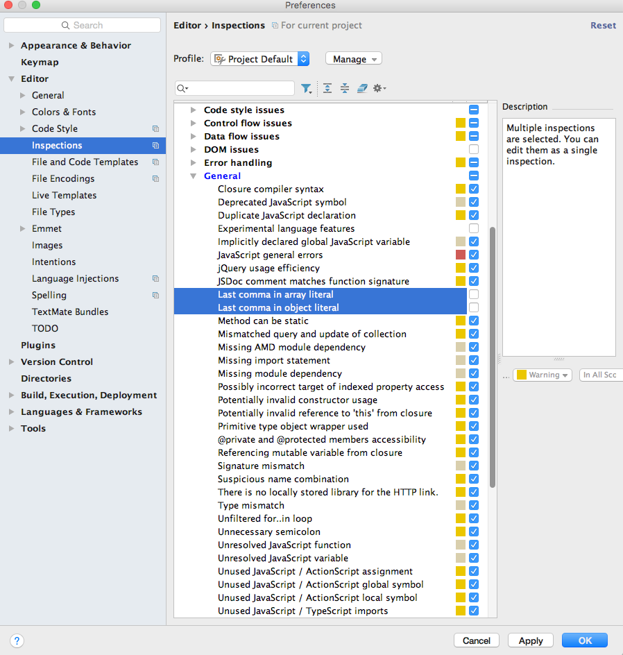

# Java Code Standard: Airbnb

Before going any further, we are going to adopt a widely used Javsscript style:

- <https://github.com/airbnb/javascript>

This guide embodies sensible, widely used standards. We will incorporate them into our project, and convince Webstorm to enforce them (issuing warning if they are violated).

First, install the jscs module globally on your workstation (not in the project as such):

~~~
npm install -g jscs
~~~

## .jscsrc

Create a new file called `.jscsrc` in your project, and copy into it the airbnb.json preset from here:

- <https://github.com/jscs-dev/node-jscs/blob/master/presets/airbnb.json>

Configuring Webstorm to read and enforce this style guide is a little involved.

First, select `File->Default Settings->Code Style` and press the 'Manage...' button:

Select JSCS as shown above, then press `Import...` button:

... selecting `JSCS config file` as shown.

Additionally, make sure your `Code Style->JavaScript` settings are as shown here:

We can reformat the code at any stage:

This will enforce Airbnb style indentation and layout - however, many of the style violations will need to be fixed manually. So for instance our two sources violate these two rules:

- requireTrailingComma
- requireLineFeedAtFileEnd

These will appear if you hover over the warnings:

Fix these, and your code should appear cleanly.

Occasionally, Webstorms `inspections` interfere with the JSCS formatting rules. If this happens, we can disable some of the conflicting inspections. Locate these settings and disable the inspections as shown:

