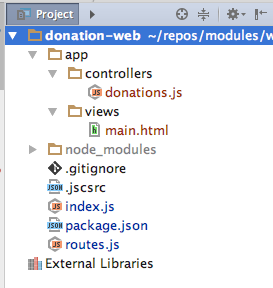
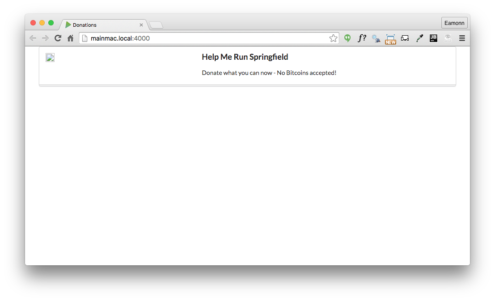

#Revised Project Structure + First Simple View (using inert)

We would like the application to render some simple HTML views. Out of the box, HAPI doesnt have a simple mechanism to do this, it is delegated to appropriate plugins to the framework.

We will use this plugin here:

- <https://github.com/hapijs/inert#static-file-server>

We install it into our app be running this command (from within our project folder):

~~~
npm install inert -save
~~~

This will download and install the module into our project. Check `package.json` to make sure it has been added:

## package.json

~~~
{
  "name": "donation-web",
  "version": "1.0.0",
  "description": "an application to host donations for candidates",
  "main": "index.js",
  "scripts": {
    "test": "echo \"Error: no test specified\" && exit 1"
  },
  "author": "",
  "license": "ISC",
  "dependencies": {
    "hapi": "^14.1.0",
    "inert": "^4.0.1"
  }
}
~~~

We modify `index.js` to register the plugin - only proceeding to start the server if the plugin is successfully loaded:

##index.js

~~~
'use strict';

const Hapi = require('hapi');

var server = new Hapi.Server();
server.connection({ port: process.env.PORT || 4000 });

server.register(require('inert'), err => {

  if (err) {
    throw err;
  }

  server.route(require('./routes'));
  server.start((err) => {
    if (err) {
      throw err;
    }

    console.log('Server listening at:', server.info.uri);
  });

});

~~~

Delete the existing `controller.js` as we will replace it with a revised structure.

Create a new folder called `app`. Inside this, create two subfolders: `controllers` and `views`. Now create these two new files in this structure:

## app/controllers/donations.js

~~~
'use strict';

exports.home = {

  handler: (request, reply) => {
    reply.file('./app/views/main.html');
  },

};

~~~

## app/views/main.html

~~~
<!DOCTYPE html>
<html>
  <head>
    <title>Donations</title>
    <meta charset="UTF-8">
    
    
    <link rel="stylesheet" media="screen" href="//cdnjs.cloudflare.com/ajax/libs/semantic-ui/2.1.6/semantic.min.css">
  </head>
  <body>
    <section class="ui container">
      <section class="ui stacked segment">
        

          <aside class="six wide column">
            
          </aside>
          <article class="ten wide column">
            <header class="ui  header"> Help Me Run Springfield</header>
            
 Donate what you can now - No Bitcoins accepted! 

          </article>
        

      </section>
    </section>
  </body>
</html>
~~~

Finaly, this existing routes file will need to be replaced with this version:

## routes.js

~~~
const Donations = require('./app/controllers/donations');

module.exports = [

  { method: 'GET', path: '/', config: Donations.home },

];

~~~

Your project should now be structured like this:

Rerun the project, and browse to:

- <http://localhost:4000>

You should see something like this:

