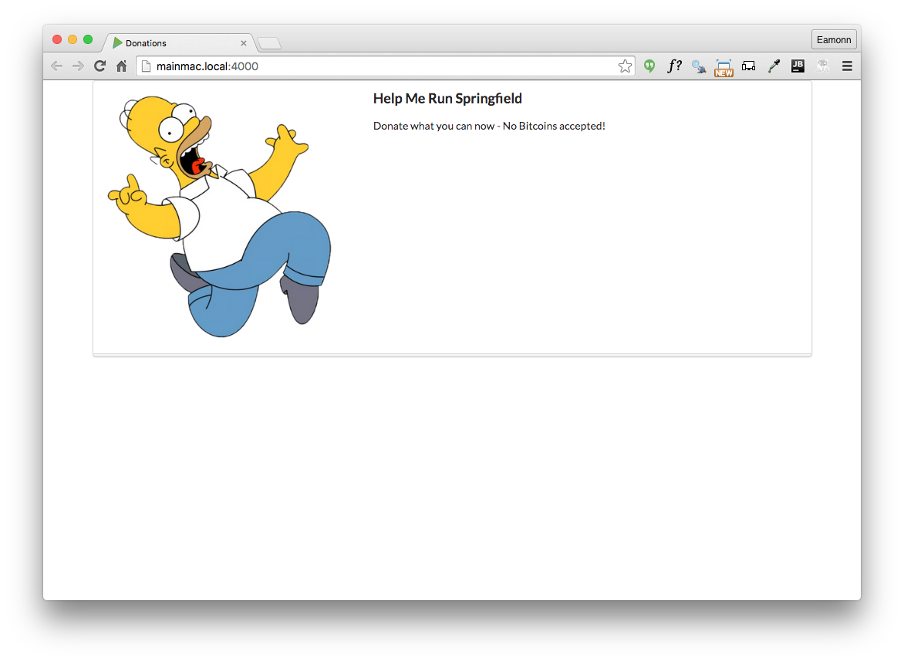

# Introduce and Serve Static Assets

Note that although we have a link to an image in our view:

~~~
          <aside class="six wide column">
            
          </aside>
~~~

.. we are not serving any actual image:

We need to create a `public` folder in our project to store static assets like images.

Note we create `public/images` in the project as shown above.

Here are some assets to put into this folder:

##favicon.png

##homer.png

Now create a controller to serve these assets:

##app/controllers/assets.js

~~~
'use strict';

exports.servePublicDirectory = {
  directory: {
    path: 'public',
  },

};

~~~

... and extend `routes.js` to serve all of the files in this folder if requested:

##routes.js

~~~
const Donations = require('./app/controllers/donations');
const Assets = require('./app/controllers/assets');

module.exports = [

  { method: 'GET', path: '/', config: Donations.home },

  {
    method: 'GET',
    path: '/{param*}',
    config: { auth: false },
    handler: Assets.servePublicDirectory,
  },

];

~~~

Run the app now - and an images should be rendered:

