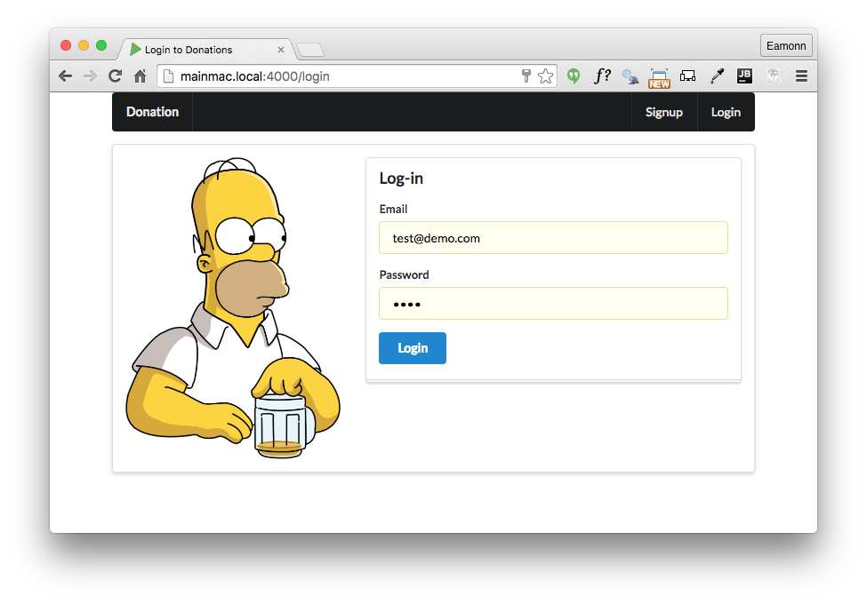

# Exercise: Additional Routes + Static Views for Login and Signup

Archive of the project so far:

- <https://bitbucket.org/edeleastar/donation-web-05/commits/all>

## Exercises:

Below is how we would like the app to look:

And below are all of the views and assets you will need to implement the above. To implement these new views, you will need to:

- Introduce 2 additional routes like these:

~~~
  { method: 'GET', path: '/signup', config: Donations.signup },
  { method: 'GET', path: '/login', config: Donations.login },
~~~

- Extend the donations controller with additional handlers:

~~~
exports.signup = {

  handler: (request, reply) => {
    reply.file('./app/views/signup.html');
  },

};

exports.login = {

  handler: (request, reply) => {
    reply.file('./app/views/login.html');
  },

};
~~~

Try to implement the new routes, controllers and views now. These are the views + images you will need:

##main.html

~~~
<!DOCTYPE html>
<html>
  <head>
    <title>Welcome to Donations</title>
    <meta charset="UTF-8">
    
    
    <link rel="stylesheet" media="screen" href="//cdnjs.cloudflare.com/ajax/libs/semantic-ui/2.1.6/semantic.min.css">
    <link rel="shortcut icon" type="image/png" href="images/favicon.png">
  </head>
  <body>
    <section class="ui container">
      <nav class="ui inverted menu">
        <header class="header item"><a href="/"> Donation </a></header>
        

          <a class="item" href="/signup"> Signup</a>
          <a class="item" href="/login"> Login</a>
        

      </nav>

      <section class="ui stacked segment">
        

          <aside class="six wide column">
            
          </aside>
          <article class="ten wide column">
            <header class="ui  header"> Help Me Run Springfield</header>
            
 Donate what you can now - No Bitcoins accepted! 

          </article>
        

      </section>
    </section>
  </body>
</html>
~~~

##signup.html

~~~
<!DOCTYPE html>
<html>
  <head>
    <title>Sign up for Donations</title>
    <meta charset="UTF-8">
    
    
    <link rel="stylesheet" media="screen" href="//cdnjs.cloudflare.com/ajax/libs/semantic-ui/2.1.6/semantic.min.css">
    <link rel="stylesheet" media="screen" href="css/main.css">
    <link rel="shortcut icon" type="image/png" href="images/favicon.png">
  </head>
  <body>
    <section class="ui container">
      <nav class="ui inverted menu">
        <header class="header item"><a href="/"> Donation </a></header>
        

          <a class="item" href="/signup"> Signup</a>
          <a class="item" href="/login"> Login</a>
        

      </nav>
      <section class="ui raised segment">
        

          

            

              <form action="/register" method="POST">
                <h3 class="ui header">Register</h3>
                

                  

                    <label>First Name</label>
                    <input placeholder="First Name" type="text" name="firstName">
                  

                  

                    <label>Last Name</label>
                    <input placeholder="Last Name" type="text" name="lastName">
                  

                

                

                  <label>Email</label>
                  <input placeholder="Email" type="text" name="email">
                

                

                  <label>Password</label>
                  <input type="password" name="password">
                

                <button class="ui blue submit button">Submit</button>
              </form>
            

          

          <aside class="ui five wide column">
            
          </aside>
        

      </section>
    </section>
  </body>
</html>
~~~

##login.html

~~~
<!DOCTYPE html>
<html>
  <head>
    <title>Login to Donations</title>
    <meta charset="UTF-8">
    
    
    <link rel="stylesheet" media="screen" href="//cdnjs.cloudflare.com/ajax/libs/semantic-ui/2.1.6/semantic.min.css">
    <link rel="stylesheet" media="screen" href="css/main.css">
    <link rel="shortcut icon" type="image/png" href="images/favicon.png">
  </head>
  <body>
    <section class="ui container">
      <nav class="ui inverted menu">
        <header class="header item"><a href="/"> Donation </a></header>
        

          <a class="item" href="/signup"> Signup</a>
          <a class="item" href="/login"> Login</a>
        

      </nav>
      <section class="ui raised segment">
        

          <aside class="ui six wide column">
            
          </aside>
          

            

              <form action="/login" method="POST">
                <h3 class="ui header">Log-in</h3>
                

                  <label>Email</label> <input placeholder="Email" type="text"
                                              name="email">
                

                

                  <label>Password</label> <input type="password" name="password">
                

                <button class="ui blue submit button">Login</button>
              </form>
            

          

        

      </section>
    </section>
  </body>
</html>
~~~

##homer2.png

##homer3.png

##homer4.png

##homer5.png

