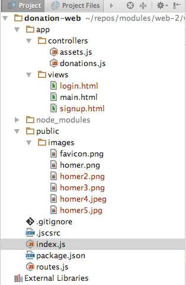

# Exercise Solutions

Incorporate all of the assets from Lab-5.1 exercises step into the project:

(Note that `main.html` contains additional elements, so replace your version with the copy in the exercises).

Here are revised sources to implement the new views:

## routes.js

~~~
const Donations = require('./app/controllers/donations');
const Assets = require('./app/controllers/assets');

module.exports = [

  { method: 'GET', path: '/', config: Donations.home },
  { method: 'GET', path: '/signup', config: Donations.signup },
  { method: 'GET', path: '/login', config: Donations.login },

  {
    method: 'GET',
    path: '/{param*}',
    config: { auth: false },
    handler: Assets.servePublicDirectory,
  },

];

~~~

## app/controllers/donations.js

~~~
'use strict';

exports.home = {

  handler: (request, reply) => {
    reply.file('./app/views/main.html');
  },

};

exports.signup = {

  handler: (request, reply) => {
    reply.file('./app/views/signup.html');
  },

};

exports.login = {

  handler: (request, reply) => {
    reply.file('./app/views/login.html');
  },

};

~~~

