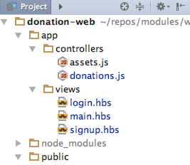

#First Handlebar Expressions

Rename each of the view from `.html` to `.hbs`:

Currently the `<title>` element of each view is hard coded. Replace this element in each view with a handlebars style parameter:

##main.hbs

~~~
    <title>{{title}}</title>
~~~

##signup.hbs

~~~
    <title>{{title}}</title>
~~~

##login.hbs

~~~
    <title>{{title}}</title>
~~~

We can now refactor the controller to pass the actual title to the view when is is being rendered:

##app/controllers/donations.js

~~~
'use strict';

exports.home = {

  handler: (request, reply) => {
    reply.view('main', { title: 'Welcome to Donations' });
  },

};

exports.signup = {

  handler: (request, reply) => {
    reply.view('signup', { title: 'Sign up for Donations' });
  },

};

exports.login = {

  handler: (request, reply) => {
    reply.view('login', { title: 'Login to Donations' });
  },

};

~~~

Test this out now. There should be no noticeable change.