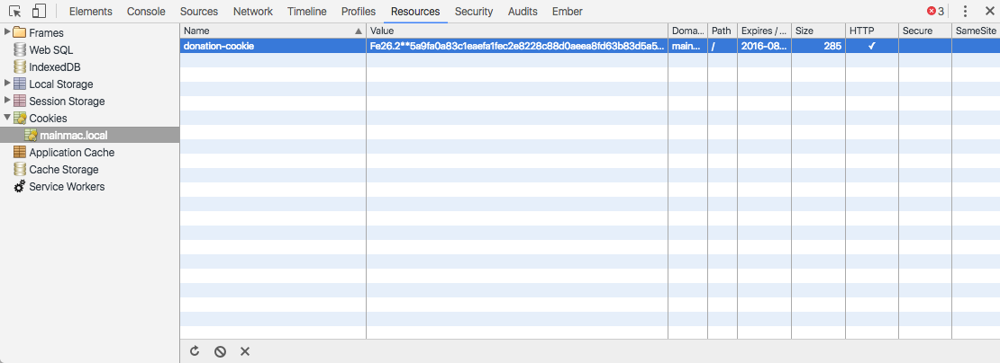

#Cookie Setting & Clearing

We should now remove the `currentUser` server object:

~~~
server.bind({
  // currentUser: {},
  users: {},
  donations: [],
});
~~~

as we will be using an alternative mechanism to track the user.

## accounts.js

Modify the `authenticate` route to set a session cookie:

~~~
...
      request.cookieAuth.set({
        loggedIn: true,
        loggedInUser: user.email,
      });
...
~~~

Do this just after we have verified that the user has valid credentials:

~~~
exports.authenticate = {
  auth: false,
  handler: function (request, reply) {
    const user = request.payload;
    if ((user.email in this.users) && (user.password === this.users[user.email].password)) {
      request.cookieAuth.set({
        loggedIn: true,
        loggedInUser: user.email,
      });
      reply.redirect('/home');
    } else {
      reply.redirect('/signup');
    }
  },

};
~~~

In the logout route - we can clear the session:

~~~
exports.logout = {
  auth: false,
  handler: function (request, reply) {
    request.cookieAuth.clear();
    reply.redirect('/');
  },
~~~

Restart the app - and you should now be able to log in, make donations and view reports.

However, the donor will not be visible on the report - as we have disabled that mechanism (see above).

Before moving on to the next step - see if you can inspect the cookie using chrome developer tools. You might see something like this:

Note that you can delete the cookie here - this may be useful during development, particularly if you are modifying some of the cookie characteristics. The older version of the cookie might interfere with the refreshed one.

