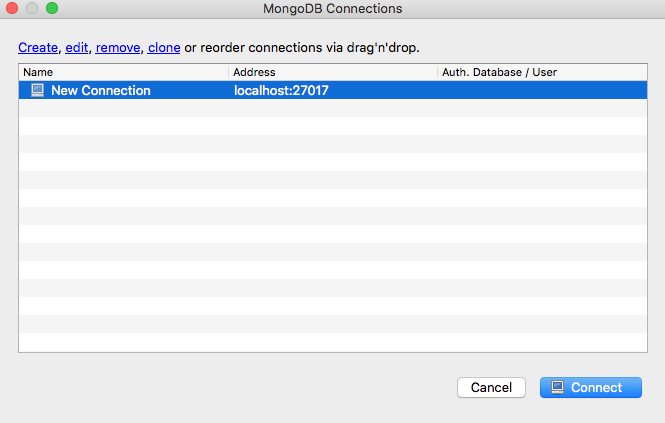
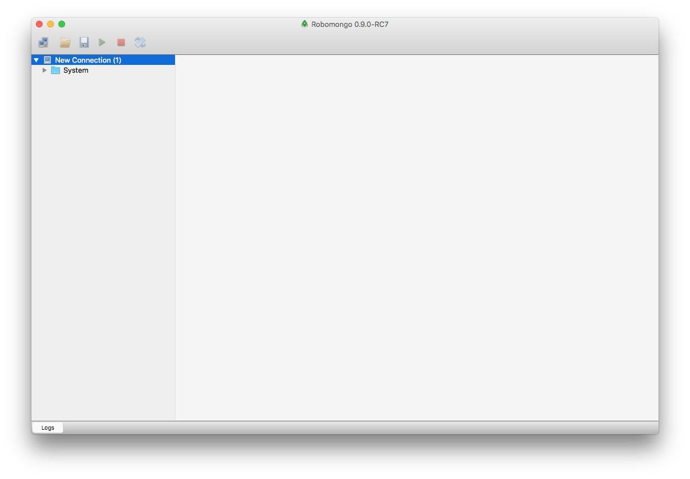

# Mongo + Mongoose install

Visit the following site, locate the installation for your platform and install the MongoDB application:

- <https://www.mongodb.org>

A suitable distribution from here should suffice:

- <https://www.mongodb.com/download-center#community>

Additionally, install this simple UX for Mongo:

- <https://robomongo.org>

Typically, to launch the mongodb database service on your platform, first create a directory somewhere to store the database itself:

~~~
mkdir db
~~~

Then enter the following command to launch the service:

~~~
mongod -dbpath db
~~~

Now launch Robomongo:

.. and establish a default connection to the service you just started:

