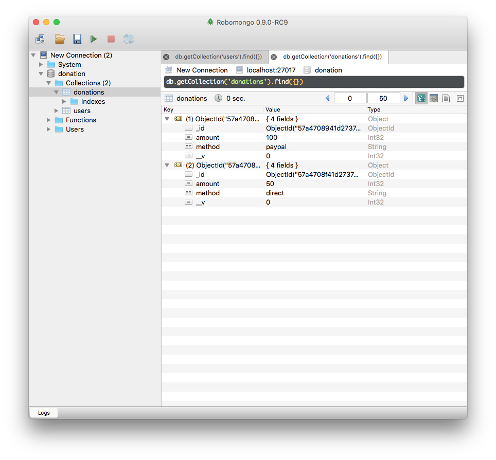

# Introduce Donation Model

This is a donation schema to represent individual donations:

##app/models/donation.js

~~~
const mongoose = require('mongoose');

const donationSchema = mongoose.Schema({
  amount: Number,
  method: String,
});

const Donation = mongoose.model('Donation', donationSchema);
module.exports = Donation;

~~~

the donate and report routes can then be updated to use this model:

## app/controllers/donations.js

~~~
const Donation = require('../models/donation');
~~~

~~~
exports.donate = {

  handler: function (request, reply) {
    let data = request.payload;
    const donation = new Donation(data);
    donation.save().then(newDonation => {
      reply.redirect('/report');
    }).catch(err => {
      reply.redirect('/');
    });
  },

};

exports.report = {

  handler: function (request, reply) {
    Donation.find({}).exec().then(allDonations => {
      reply.view('report', {
        title: 'Donations to Date',
        donations: allDonations,
      });
    }).catch(err => {
      reply.redirect('/');
    });
  },

};
~~~

Try this now and verify that you can make donations and view them in Robomongo:

