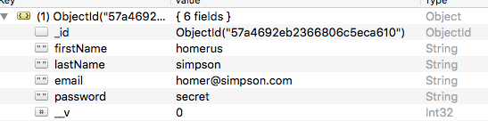
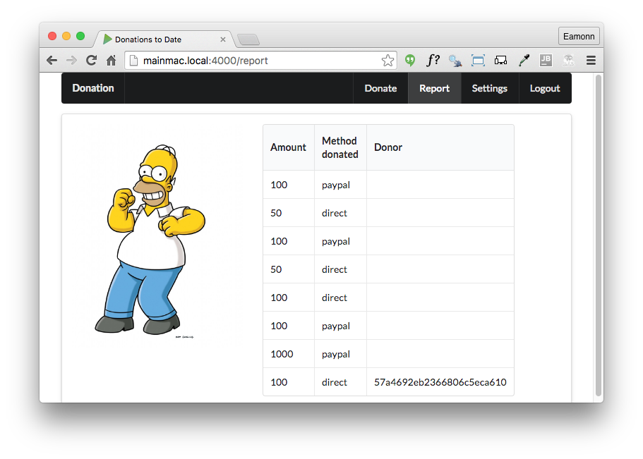

# Incorporate Donor Object Reference into Donation

Currently our donation Schema looks like this:

~~~
const donationSchema = mongoose.Schema({
  amount: Number,
  method: String,
  donor: String,
});
~~~

The donor is represented by a simple string - we have been using the users email. To retrieve further information on the donor we would need to do an additional query.

A more sophisticated approach would be to use an object reference directly to the User object:

##app/models/donation.js

~~~
const donationSchema = mongoose.Schema({
  amount: Number,
  method: String,
  donor: {
    type: mongoose.Schema.Types.ObjectId,
    ref: 'User',
  },
});
~~~

##app/controler/donation.js

Now, when we create a donation, we will need to gain access to the object reference of the donor and use this reference to initialise the donation object.

First, import the User model:

~~~
const User = require('../models/user');
~~~

Then reimplement the donation handler to establish the link to the donation:

~~~
exports.donate = {

  handler: function (request, reply) {
    var userEmail = request.auth.credentials.loggedInUser;
    User.findOne({ email: userEmail }).then(user => {
      let data = request.payload;
      const donation = new Donation(data);
      donation.donor = user._id;
      return donation.save();
    }).then(newDonation => {
      reply.redirect('/report');
    }).catch(err => {
      reply.redirect('/');
    });
  },

};
~~~

Restart the app now and make a donation. Examine the donation object in Robomongo:

Note the object reference `donor`. Verify that the id corresponds with the corresponding user object:

The report view, however, will now only display these ids:

We will fix this in the next step.
