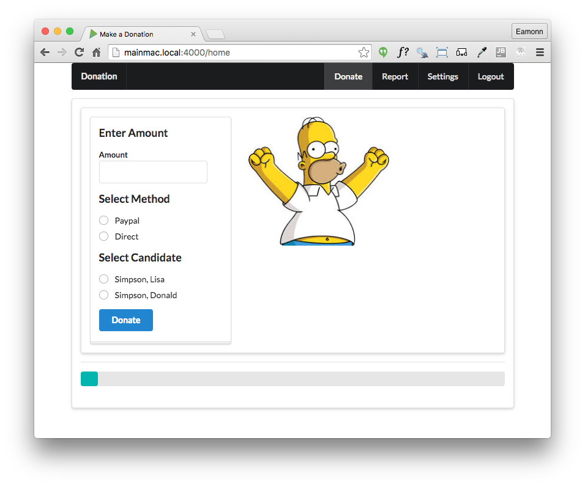

#Lab 11 Exercise Solutions

## Exercise 1: 

Change the donate screen such that users can donate any amount and not just 50, 100, 1000 multiples. For example:

## app/views/partials/donate.hbs

## Exercise 1 Solution

Replace the drop down in `donate.hbs`:

~~~
          

            <input type="hidden" name="amount">
            
Select Amount

            <i class="ui dropdown icon"></i>
            

              
50

              
100

              
1000

            

          

~~~

...with an input field:

~~~
          

            <h3> Enter Amount </h3>
            

              <label>Amount</label> <input type="number" name="amount">
            

          

~~~

Replace the 

##Exercise 2: 

Modify the report view to display total donated so far:

## Exercise 2 Solution

## app/views/partials/donationlist.hbs

Incorporate a new footer element in `donationlist.hbs` after the closing `<tbody>` tag:

~~~
        <tfoot>
          <tr>
            <th>{{total}}</th>
            <th>Total</th>
          </tr>
        </tfoot>
~~~

## app/controllers/donations.js

Rework the report route to also render the total to the view:

~~~
exports.report = {

  handler: function (request, reply) {
    Donation.find({}).populate('donor').populate('candidate').then(allDonations => {
      let total = 0;
      allDonations.forEach(donation => {
        total += donation.amount;
      });
      reply.view('report', {
        title: 'Donations to Date',
        donations: allDonations,
        total: total,
      });
    }).catch(err => {
      reply.redirect('/');
    });
  },

};
~~~

##Exercise 3: 

Incorporate validation into the donate view:

Exercise 3 Solution:

## app/controllers/donations.js

Reimplement the donate route handler as follows:

~~~
exports.donate = {

  validate: {

    payload: {
      amount: Joi.number().required(),
      method: Joi.string().required(),
      candidate: Joi.string().required(),
    },

    options: {
      abortEarly: false,
    },

    failAction: function (request, reply, source, error) {
      Candidate.find({}).then(candidates => {
        reply.view('home', {
          title: 'Invalid Donation',
          candidates: candidates,
          errors: error.data.details,
        }).code(400);
      }).catch(err => {
        reply.redirect('/');
      });
    },
  },

  handler: function (request, reply) {
    var userEmail = request.auth.credentials.loggedInUser;
    let userId = null;
    let donation = null;
    User.findOne({ email: userEmail }).then(user => {
      let data = request.payload;
      userId = user._id;
      donation = new Donation(data);
      const rawCandidate = request.payload.candidate.split(',');
      return Candidate.findOne({ lastName: rawCandidate[0], firstName: rawCandidate[1] });
    }).then(candidate => {
      donation.donor = userId;
      donation.candidate = candidate._id;
      return donation.save();
    }).then(newDonation => {
      reply.redirect('/report');
    }).catch(err => {
      reply.redirect('/');
    });
  },

};
~~~