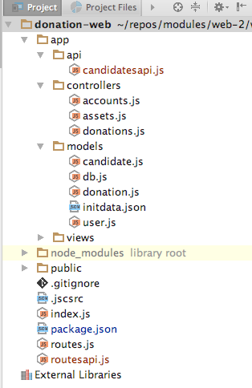

# First Simple API Endpoint: Get All Candidates

Introduce a new folder inside app called `api`, and place the following module in that folder:

## app/api/candidatesapi.js

~~~
'use strict';

const Candidate = require('../models/candidate');
const Boom = require('boom');

exports.find = {

  auth: false,

  handler: function (request, reply) {
    Candidate.find({}).exec().then(candidates => {
      reply(candidates);
    }).catch(err => {
      reply(Boom.badImplementation('error accessing db'));
    });
  },

};

~~~

This handler returns all candidates, or a standard error message. Note that we have set no authentication:

~~~
  auth: false,
~~~

... which means that this call is open, and is not guarded by the session based authentication currently set as the default for our application.

## routesapi.js

We new include a new routes file specifically to service the API routes:

~~~
const CandidatesApi = require('./app/api/candidatesapi');

module.exports = [
  { method: 'GET', path: '/api/candidates', config: CandidatesApi.find },
];

~~~

Place this in the root of the project, which should look like this now:

## index.js

Finally, we need to include this route into the application server - this is in `index.js` - we can add it after the inclusion of the UI routes we have created so far::

~~~
  server.route(require('./routes'));
  server.route(require('./routesapi'));
~~~

We can run the app now, and verify that the route can be accessed:

- <http://localhost:4000/api/candidates>

We also can see the seeded objects in the webstorm console:

Note that these objects (including ids) should be identical.

