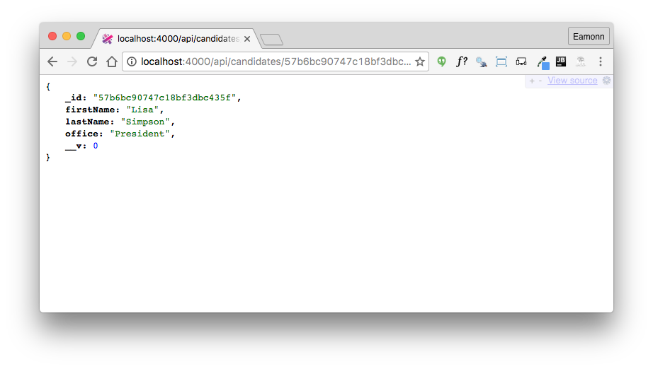

# Get Candidate Endpoint

The first endpoint we have just implemented retrieves all candidates. We can also introduce a route to retrieve a single candidate:

## routesapi.js

~~~
  { method: 'GET', path: '/api/candidates/{id}', config: CandidatesApi.findOne },
~~~

## app/api/candidatesapi.js

~~~
exports.findOne = {

  auth: false,

  handler: function (request, reply) {
    Candidate.findOne({ _id: request.params.id }).then(candidate => {
      reply(candidate);
    }).catch(err => {
      reply(Boom.notFound('id not found'));
    });
  },

}

~~~

In order to retrieve the candidate, we will need the ID for the candidate of interest:

- <http://localhost:4000/api/candidates/57b6bbd3a11377b03d31da0a>

The Id changes every time we launch the application, as our database seeder clears all collections each time.

If we specify an unknown id, Boom will generate the appropriate error:

Note also, that if we use an incorrect route - for instance:

- <http://localhost:4000/candidates>

We also get the standard 404 error:

