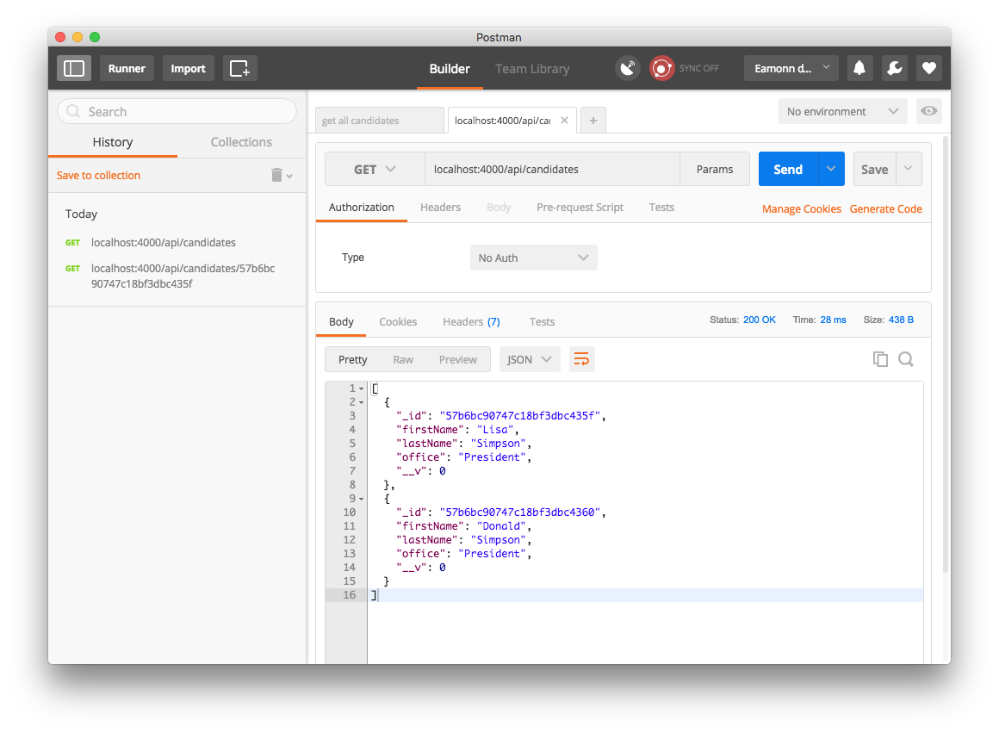
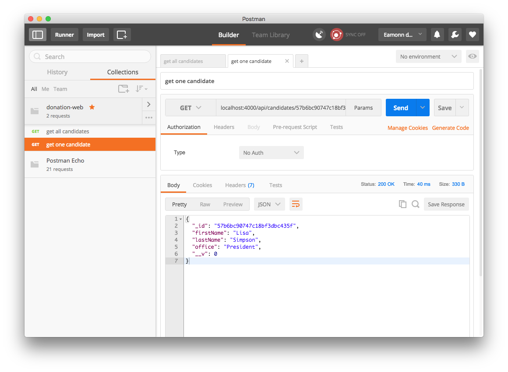

# Testing the Endpoints: Postman

Using a browser to retrieve and verify the behaviour of api endpoints is a useful sanity check, but not viable as our endpoints become more sophisticated.

This is a popular tool for exercising these endpoints:

- <https://www.getpostman.com/>

Install the standalone version now. We will make use of it occasionally as we devise more interesting api endpoints:

Build some request now for one of our endpoints:

You can save and organise requests into collections:

This can be useful for exercising more complex APIs
