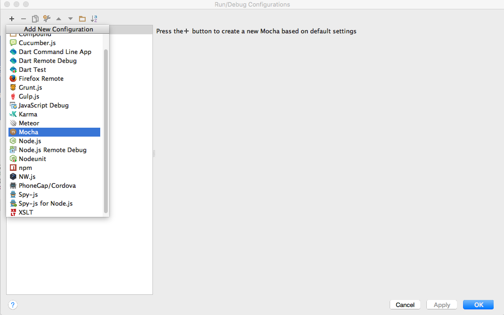

# Testing the Endpoints: TDD Tools

Although Postman is useful for exploratory development, developing APIs requires a more robust testing strategy. This is the realm of Test Driven Development:

- <https://en.wikipedia.org/wiki/Test-driven_development>

Facilitated by specialized tools and techniques. The most fundamental set of tools are based around the so-called `X-Unit` pattern:

- <https://en.wikipedia.org/wiki/XUnit>

We are going to use these two X-Unit related tools:

- <https://mochajs.org/>
- <http://chaijs.com/>

To use these tools, we need install both extensions to our WebStorm IDE and also the appropriate javascript libraries.

Mocha support should already be part of your WebStorm installation:

We will explore this in a moment.

To make use of TDD in our app, we need to instal the mocha and chai modules:

~~~
npm install mocha -save-dev
npm install chai -save-dev
~~~

Node the `-save-dev` switch. This establishes the libraries as development, not production, libraries - required only for dev/test purposes. 

Package.json includes these references in a separate section:

~~~
{
  "name": "donation-web",
  "version": "1.0.0",
  "description": "an application to host donations for candidates",
  "main": "index.js",
  "scripts": {
    "start": "node index",
    "test": "echo \"Error: no test specified\" && exit 1"
  },
  "author": "",
  "license": "ISC",
  "dependencies": {
    "boom": "^3.2.2",
    "handlebars": "^4.0.5",
    "hapi": "^14.1.0",
    "hapi-auth-cookie": "^6.1.1",
    "inert": "^4.0.1",
    "joi": "^9.0.4",
    "mongoose": "^4.5.8",
    "mongoose-seeder": "^1.2.1",
    "vision": "^4.1.0"
  },
  "devDependencies": {
    "chai": "^3.5.0",
    "mocha": "^3.0.2"
  }
}

~~~