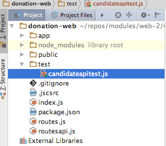
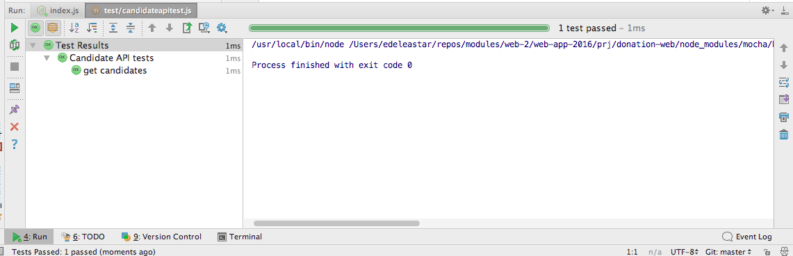
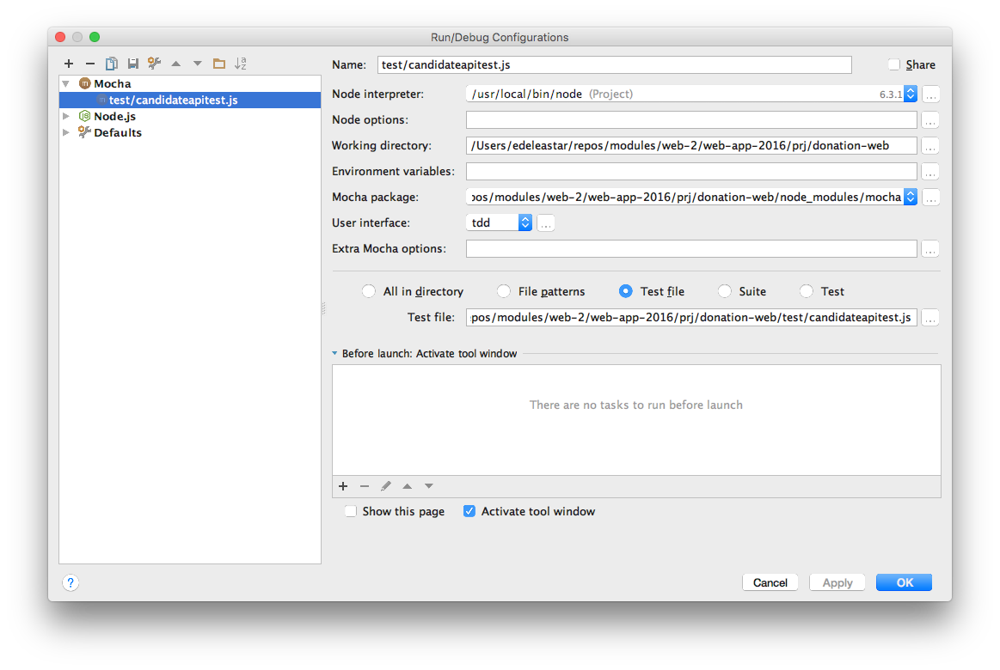
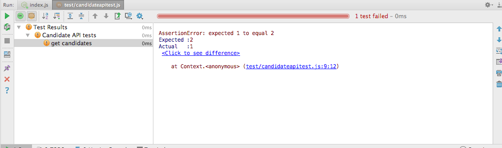

# First Simple Test

Create a new folder in your project called `test` and create `candidateapitest.js` module:

## test/candidateapitest.js

~~~
'use strict';

const assert = require('chai').assert;

suite('Candidate API tests', function () {

  test('get candidates', function () {

    assert.equal(1, 1);

  });
});

~~~

This is a simple test, guaranteed to succeed. 

In order to run it, select the file and select run from the context menu. We should see the built in Mocha test runner:

If your WebStorm installation does not auto generate the above run configuration, you may need to manually establish a run configuration in the IDE:

In order to gain familiarity with the Mochal test runner, change the assert to be guaranteed to fail:

~~~
    assert.equal(1, 1);
~~~

Now rerun the test - this is how test failures are reported:

