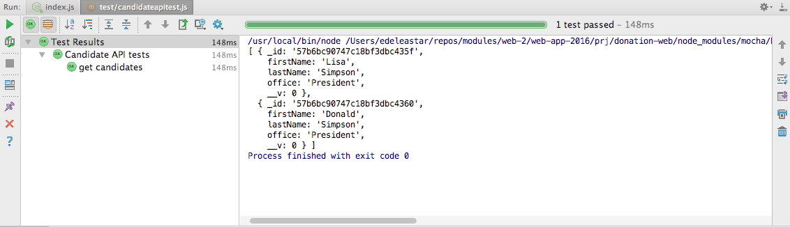

# First Mocha API Test

We can now compose a test, entirely in javascript, to exercise the api we have just created.

First, we will make use of a module to encapsulate http requests:

- <https://github.com/ForbesLindesay/sync-request>

Note the health warning here - this library is of test purposes only. It is `synchronous` as opposed to `asynchronous`:

- <https://en.wikipedia.org/wiki/Asynchrony_(computer_programming)>

However, the synchronous approach of this library significantly simplifies unit test composition, so we will make use of it.

Install it as a development dependency:

~~~
npm install sync-request -save-dev
~~~

## pachage.json

~~~
{
  "name": "donation-web",
  "version": "1.0.0",
  "description": "an application to host donations for candidates",
  "main": "index.js",
  "scripts": {
    "start": "node index",
    "test": "echo \"Error: no test specified\" && exit 1"
  },
  "author": "",
  "license": "ISC",
  "dependencies": {
    "boom": "^3.2.2",
    "handlebars": "^4.0.5",
    "hapi": "^14.1.0",
    "hapi-auth-cookie": "^6.1.1",
    "inert": "^4.0.1",
    "joi": "^9.0.4",
    "mongoose": "^4.5.8",
    "mongoose-seeder": "^1.2.1",
    "vision": "^4.1.0"
  },
  "devDependencies": {
    "chai": "^3.5.0",
    "mocha": "^3.0.2",
    "sync-request": "^3.0.1"
  }
}
~~~

Here is a revised version of the first test suite:

## test/candidateapitest.js

~~~
'use strict';

const assert = require('chai').assert;
var request = require('sync-request');

suite('Candidate API tests', function () {

  test('get candidates', function () {

    const url = 'http://localhost:4000/api/candidates';
    var res = request('GET', url);
    console.log(JSON.parse(res.getBody('utf8')));

  });
});

~~~

Running the test will echo the returned candidates:

All tests should have assertions, and rarely would we make use of the console. Replace the test body with the following:

~~~
    const url = 'http://localhost:4000/api/candidates';
    var res = request('GET', url);
    const candidates = JSON.parse(res.getBody('utf8'));
    assert.equal(2, candidates.length);
~~~

How do we know there are exactly two candidates? Recall that we seeded the database with the contents of `app/models/initdata.json`

~~~
{
  "users": {
    "_model": "User",
    "homer": {
      "firstName": "Homer",
      "lastName": "Simpson",
      "email": "homer@simpson.com",
      "password": "secret"
    },
    "marge": {
      "firstName": "Marge",
      "lastName": "Simpson",
      "email": "marge@simpson.com",
      "password": "secret"
    },
    "bart": {
      "firstName": "Bart",
      "lastName": "Simpson",
      "email": "bart@simpson.com",
      "password": "secret"
    }
  },
  "candidates": {
    "_model": "Candidate",
    "lisa": {
      "firstName": "Lisa",
      "lastName": "Simpson",
      "office": "President"
    },
    "donald": {
      "firstName": "Donald",
      "lastName": "Simpson",
      "office": "President"
    }
  },
  "donations": {
    "_model": "Donation",
    "one": {
      "amount": 40,
      "method": "paypal",
      "donor": "->users.bart",
      "candidate": "->candidates.lisa"
    },
    "two": {
      "amount": 90,
      "method": "direct",
      "donor": "->users.marge",
      "candidate": "->candidates.lisa"
    },
    "three": {
      "amount": 430,
      "method": "paypal",
      "donor": "->users.homer",
      "candidate": "->candidates.donald"
    }
  }
}
~~~

We can extend the test to make sure we actually retrieve the candidates as specified in the above data set:

~~~
  test('get candidates', function () {

    const url = 'http://localhost:4000/api/candidates';
    var res = request('GET', url);
    const candidates = JSON.parse(res.getBody('utf8'));

    assert.equal(2, candidates.length);

    assert.equal(candidates[0].firstName, 'Lisa');
    assert.equal(candidates[0].lastName, 'Simpson');
    assert.equal(candidates[0].office, 'President');

    assert.equal(candidates[1].firstName, 'Donald');
    assert.equal(candidates[1].lastName, 'Simpson');
    assert.equal(candidates[1].office, 'President');

  });
~~~

This test should pass.

Testing our second route involves a little more work, as we have to request a single candidate by an ID. We get this ID from the request for all candidates.

This new test demonstrates the technique:

~~~
  test('get one candidate', function () {

    const allCandidatesUrl = 'http://localhost:4000/api/candidates';
    var res = request('GET', allCandidatesUrl);
    const candidates = JSON.parse(res.getBody('utf8'));

    const oneCandidateUrl = allCandidatesUrl + '/' + candidates[0]._id;
    res = request('GET', oneCandidateUrl);
    const oneCandidate = JSON.parse(res.getBody('utf8'));

    assert.equal(oneCandidate.firstName, 'Lisa');
    assert.equal(oneCandidate.lastName, 'Simpson');
    assert.equal(oneCandidate.office, 'President');

  });
~~~

