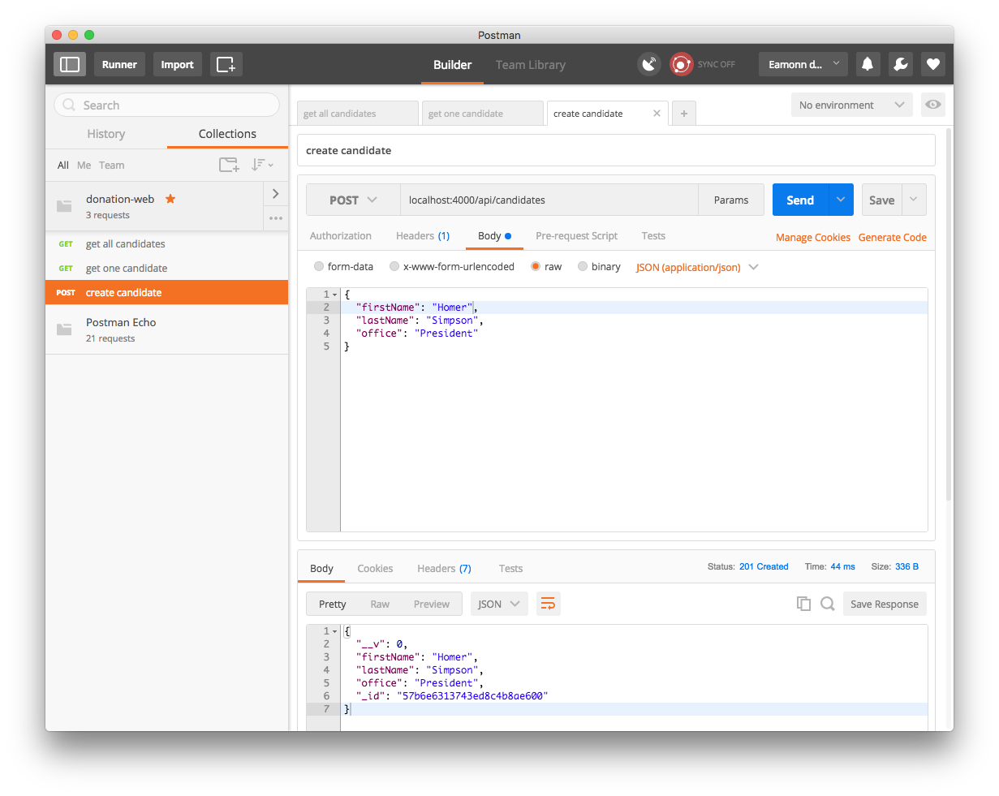

# Exercises

Archive of the project so far:

- <https://bitbucket.org/edeleastar/donation-web-11/commits/all>

## Exercise 1 : Additional Unit Tests

Write tests for the untested endpoints:

- delete a singe candidate
- delete all candidates

## Exercise 2: Postman

Postman can be used to test these new `POST` and `DELETE`routes. Try to figure out how to do this.

HINT: Below is an example of a successful create candidate endpoint request:

## Exercise 3: User Endpoints

Using this lab as a guide, develop a set of endpoints for the users collection, including:

- get all users
- create a user
- delete a user
- delete all users

Also implement tests to verify the endpoints work as expected.