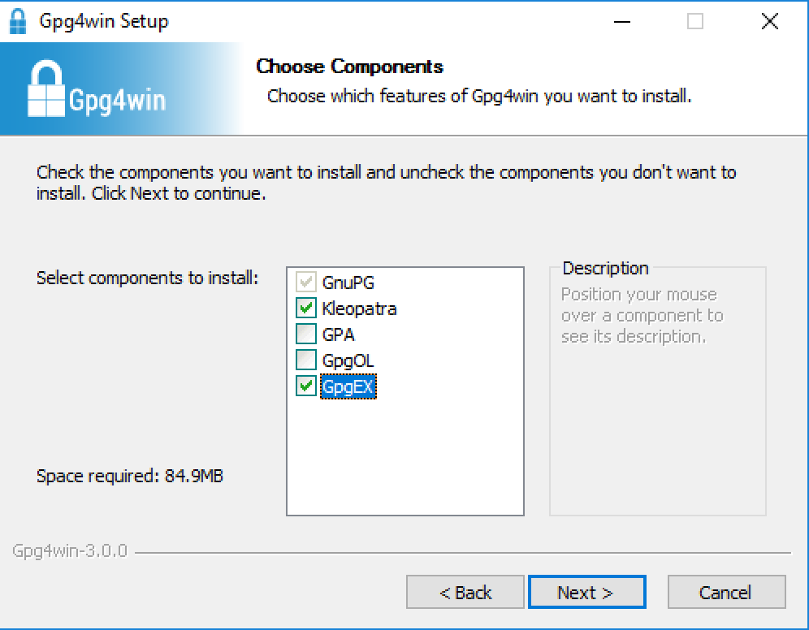

## 1. Installation

If using Windows, before starting, change your settings to [make file extensions viewable](http://kb.winzip.com/kb/entry/26/). This is not essential, but makes it easier to distinguish between files that are encrypted and those that are not.

Locate and install a fresh version of GPG (or PGP) for your operating system of choice.  Recommendations:

* Windows: [Gpg4win](https://www.gpg4win.org/download.html)
* MacOS: [GPG Suite](https://gpgtools.org/)  -or- gpg / gpg2 terminal commands
* Linux: Kleopatra (on Ubuntu: 'sudo apt install kleopatra') -or- gpg / gpg2 terminal commands

The remainder of these lab instructions assume that you are working with [Gpg4win](https://www.gpg4win.org/download.html) on Windows, although they are fairly easily adaptable to MacOS or Linux.  Step 6 explains how to do all the steps of this lab at the command line.

Install Gpg4win by double-clicking on the downloaded file (gpg4win-3.0.0.exe).  When asked to choose components, ensure that *Kleopatra* and *GpgEX* are checked. Uncheck *GpgOL*. 

You may choose the default install location at the next step.
