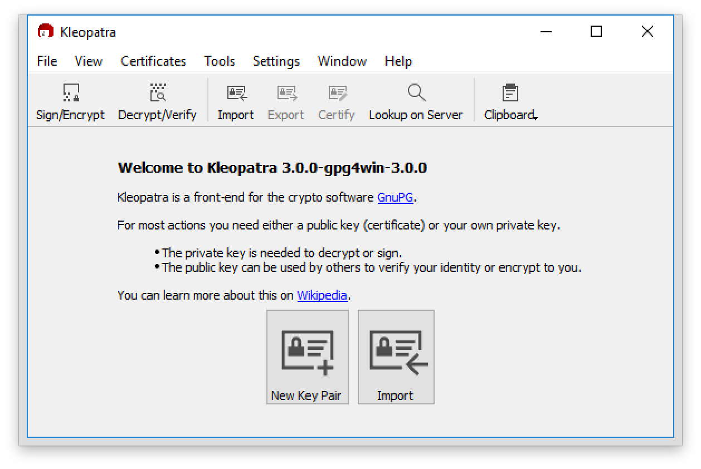

## 2. Key Generation, Management & Exchange

* Launch the Kleopatra application. This is the GUI for GPG. 

* Select *New Key Pair*. Enter your name and email address. Use your real name (email address doesn’t really matter). If you click *Advanced Settings* within this dialogue, you can choose algorithms and key settings but the defaults (2048-bit RSA) are fine.

* You are asked to create a passphrase that will be used to protect storage of your private key (make a note of this passphrase to make sure you remember it).

* You can see your new  key (certificate) in the main pane of Kleopatra.

* Select your key certificate and save a copy of the public key to disk using right-click menu (Export...). Save this to a file called *yourfirstname-lastname.asc* for inclusion in your Moodle upload (details at end).

* Select your key certificate again and save a copy of the *private* key to disk using right-click menu (Export Secret Keys...).  Name the file *yourfirstname-lastname-private.asc*. (Do not upload this to Moodle or give to anyone else as it is private to you). This file should be kept securely as a backup.

* Share the first (public key) certificate file with your classmate(s).

* Import the public key certificate(s) provided to you by your classmate(s). With Kleopatra you can just drag the file into the main pane.  You will be prompted to certify that this is *really* their key - one way to check this is to verify the key certificate's cryptographic hash with the key owner.  In the next step it is sufficient to certify for yourself for now.  You are *signing* the key certificate being imported to declare your belief that it genuinely belongs to the named owner.  As the signing process requires your own private key, you are prompted for your passphrase. 

* Have a look at the public keys exchanged.  Find some PGP/GPG public keys online, either posted on people’s web pages or on specialist key servers – e.g. https://pgp.mit.edu/. You should be able to find my public key there or you can [copy it directly from here](archive/JimmyMcGibney_public_key.txt). Import these into your GPG installation. Beware that there may be fake keys out there...
