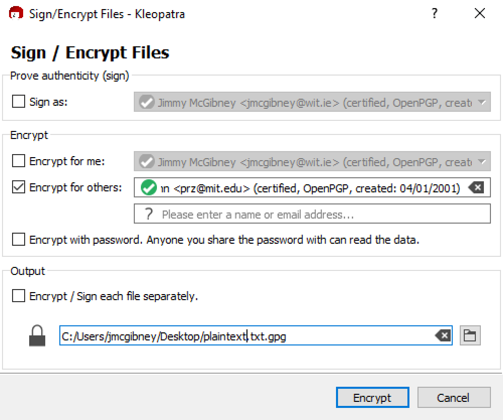

## 3. Sharing encrypted files

*Note: When you encrypt a file to give to someone else, you do so with their public key. When you decrypt a file, you do so with your private key.*

* Import (*File->Import...*) classmates’ public keys.

* Create a number of files (e.g. text files), on the desktop for example. Selecting a file and clicking the right mouse button gives access to the *GpgEX* menu. This is a convenient way to encrypt or sign files. Select *Sign and Encrypt*. Check *Encrypt for others* and select your recipient. You may uncheck the other checkboxes on this dialogue.

* Send the encrypted file to your classmate. Find out if he/she can decrypt the file.

* Also send your public key to a classmate. Try to decrypt a file that he/she sends to you (*More GpgEX options->Decrypt*).

