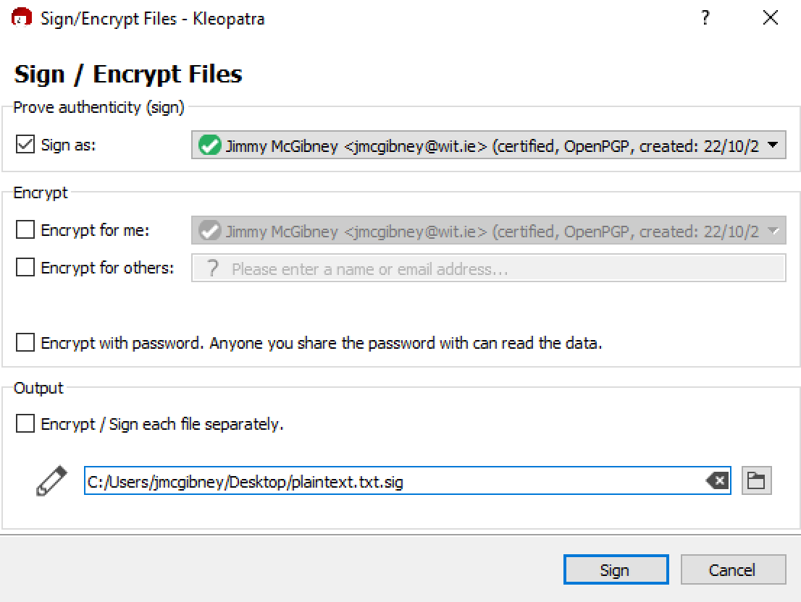

## 4. Authenticating files 

*Note: When you verify someone else’s signed file, you do so with their public key. When you sign a file, you do so with your private key.*

* Sign a file (right click and select Select *Sign and Encrypt*) and send the signature created to a classmate along with the original file that you have signed. You can uncheck the Encrypt checkboxes this time.

* For files received from others, verify origin (*More GpgEX options->Verify*). You need to have their public key to do this. 
