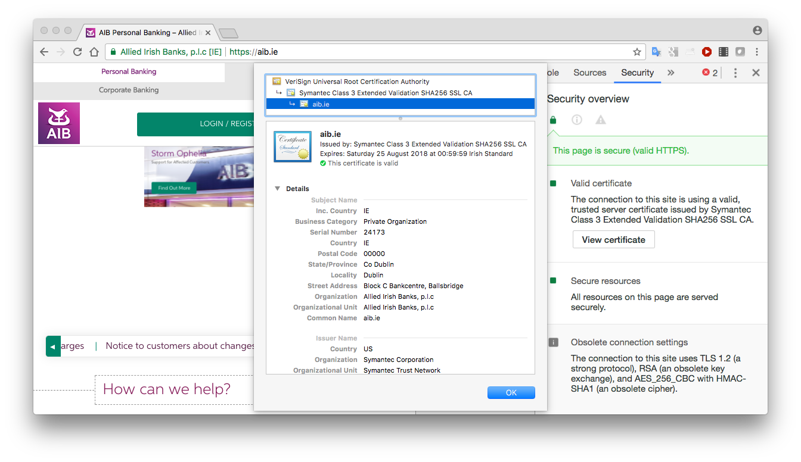

# Digital Certificates

The objectives of this step are to examine digital certificates.  

* Visit any website that provides *https://* access. 

* Copy its server certificate to a DER-encoded or PEM-encoded file (usually ".cer", “.crt” or ".pem" extension”). How you do this depends on the browser:
  * Chrome on Windows: right-click anywhere on the page and select *Inspect*.  Choose the *Security* tab in the inspection pane that appears. Click *View Certificate*. Select the *Details* tab and click *Copy to file*. This allows you to create a DER-encoded file.
  *	Chrome on Mac: right-click anywhere on the page and select *Inspect*.  Choose the *Security* tab in the inspection pane that appears. Click *View Certificate* and drag the certificate graphic into a folder. This should create a DER-encoded file by default.
  * Firefox: click on the lock icon beside the browser’s address bar. Click the right arrow beside *Secure Connection* and then *More information* and *View Certificate*. In the Certificate Viewer, select the *Details* tab and click *Export*.  This will create a PEM-encoded file.
  * Internet Explorer: click on the lock icon beside the browser’s address bar and then *View certificates*. . In the *Certificate Viewer*, select the *Details* tab and click *Copy to file*. If using Windows 10, this may be greyed out if you are not an administrator. In this case restart IE by right clicking and *Run as Administrator*.
  

 

* These certificate formats are binary.  Try to read them with a text editor; e.g.
~~~
cat moodlecert.cer
~~~
or
~~~
cat moodlecert.pem
~~~
(actually PEM format is Base64-encoded, meaning that it is printable text, but it is not human-readable)  

* OpenSSL provides tools to allow us to examine and manipulate certificates. For example the following command allows us to view certificate details; e.g.
~~~
openssl x509 -inform DER -in moodlecert.cer -text -noout
~~~
or
~~~
openssl x509 -inform PEM -in moodlecert.crt -text -noout
~~~
(the -noout option here suppresses printing of the PEM-encoding as well, which is the default)  
or output to a human-readable text file:
~~~
openssl x509 -inform DER -in moodlecert.cer -text –noout > moodlecert.txt
~~~

* You can also convert between certificate formats using OpenSSL:
~~~
openssl x509 -inform DER -in moodlecert.cer -outform PEM -out moodlecert.pem
~~~

