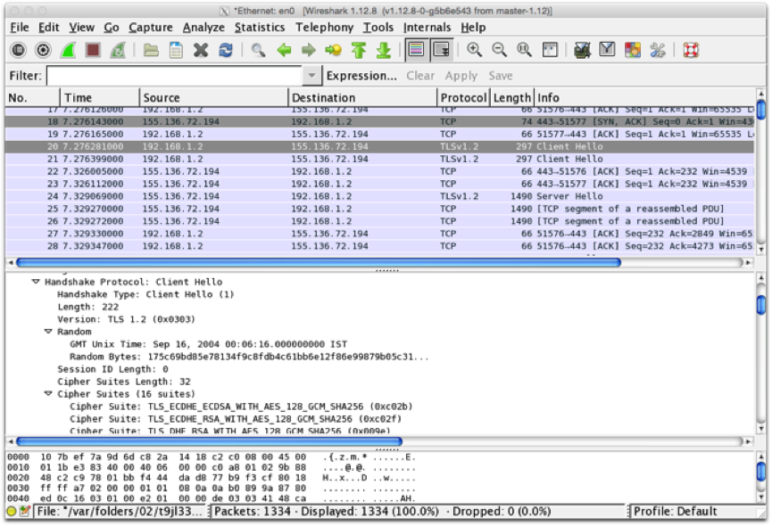

# (Optional) Configuring cipher suites

* Using [Wireshark](https://www.wireshark.org/) or equivalent, capture the setup of a TLS session from a browser to a web server. It should start with a "Client Hello" message, something like that shown here: 

* Trace the TLS handshake. What TLS version is used? What Cipher Suite does the browser prefer?  Does the server match this?  Try a variety of browsers and web servers and see if you can find examples where they don't match.

* On your Nginx configuration, edit the *nginx.conf* file to force browsers to downgrade from TLSv1 and describe what happens.  Try a variety of browsers and see if they all treat this in the same way.

* Re-enable TLSv1 and now see what happens when you change the supported cipher specs to something different, and see how various browsers respond.  You'll need to change the line in the nginx SSL configuration that begins with *ssl_ciphers*.  Try for example to change it to: *RC4-MD5*

* Note that you can also force browsers to only use an up to date version and/or cipher – e.g. TLSv1.2.  Are there any disadvantages in doing this?  There are various test suites available that allow you to try old browser versions – e.g. [https://crossbrowsertesting.com](https://crossbrowsertesting.com) or [https://www.browserling.com](https://www.browserling.com)
