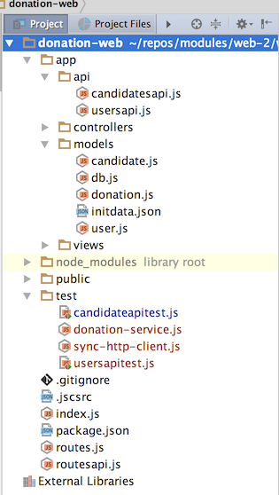

# Http & Donation Service Encapsulation classes

The tests we have written so far are somewhat verbose and repetitive. For tests to be effective, they must remain concise and easy to maintain and evolve. 

To facilitate this, we attempt to encapsulate both the http requests and the donation service access into a set of classes. These classes should simplify our tests and enable us to more easily devise more tests as the API evolves.

## sync-http-service.js

This class will encapsulate all lower level http request composition and transmission.

~~~
var request = require('sync-request');

class SyncHttpService {

  constructor(baseUrl) {
    this.baseUrl = baseUrl;
  }

  get(url) {
    var returnedObj = null;
    var res = request('GET', this.baseUrl + url);
    if (res.statusCode < 300) {
      returnedObj = JSON.parse(res.getBody('utf8'));
    }

    return returnedObj;
  }

  post(url, obj) {
    var returnedObj = null;
    var res = request('POST', this.baseUrl + url, { json: obj });
    if (res.statusCode < 300) {
      returnedObj = JSON.parse(res.getBody('utf8'));
    }

    return returnedObj;
  }
}

module.exports = SyncHttpService;
~~~

The class assumes we are always dealing with JSON payloads.

This is the first example of an ES6 Class in our labs so far. We will be making more use of these modern features in forthcoming labs.

## donation-service.js

This class encapsulates the client side of the donation api. It is layered on top of the SyncHttpClient class, and delivers a simplified interface to the unit tests.

~~~
'use strict';

const SyncHttpService = require('./sync-http-service');
const baseUrl = 'http://localhost:4000';

class DonationService {

  constructor(baseUrl) {
    this.httpService = new SyncHttpService(baseUrl);
  }

  getCandidates() {
    return this.httpService.get('/api/candidates');
  }

  getCandidate(id) {
    return this.httpService.get('/api/candidates/' + id);
  }

  createCandidate(newCandidate) {
    return this.httpService.post('/api/candidates', newCandidate);
  }

  getUsers() {
    return this.httpService.get('/api/users');
  }

  getUser(id) {
    return this.httpService.get('/api/users/' + id);
  }

  createUser(newUser) {
    return this.httpService.post('/api/users', newUser);
  }
}

module.exports = DonationService;
~~~

Place both of the classes in the test folder. Your project should look like this now:

