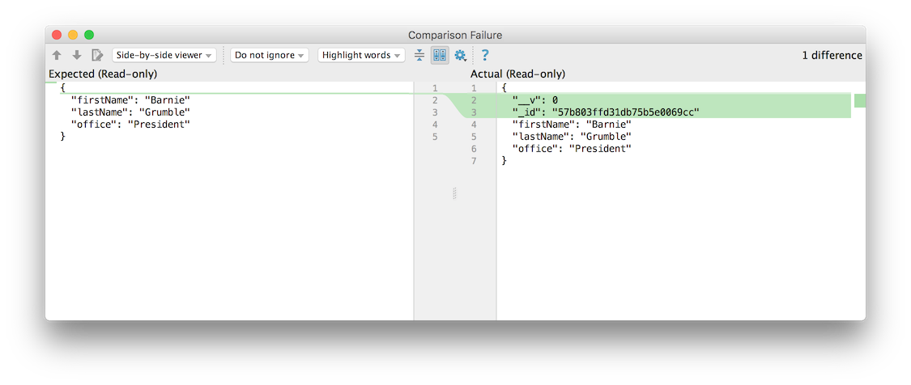

# Equals Superset Test using lodash

Looking at the test again:

~~~
  test('create a candidate', function () {
    const returnedCandidate = donationService.createCandidate(newCandidate);
    assert.equal(returnedCandidate.firstName, newCandidate.firstName);
    assert.equal(returnedCandidate.lastName, newCandidate.lastName);
    assert.equal(returnedCandidate.office, newCandidate.office);
    assert.isDefined(returnedCandidate._id);
  });
~~~

..perhaps we can simplify further, deploying the assert,equal method:

~~~
  test('create a candidate', function () {
    const returnedCandidate = donationService.createCandidate(newCandidate);
    assert.equal(returnedCandidate, newCandidate);
    assert.isDefined(returnedCandidate._id);
  });
~~~

This looks reasonable, however when we run it the test if fails. The test runner in WebStorm can show us why:

The returned object contains the fields as expected, but also additional, legitimate, fields that cause the equals test to fail. We need a comparison that will test to see if the returnedCandidate is a superset of the newCandidate object. Some solutions are discussed here:

 - <http://stackoverflow.com/questions/26092819/how-to-check-if-an-objects-properties-represent-a-super-set-of-another-object>

 The simplest involves including the `lodash` library

- <https://lodash.com/>

This provides many useful utilities functions, including :

- <https://lodash.com/docs#some>

First we install lodash:

~~~
npm install lodash -save
~~~

Require is at the top of our test:

~~~
const _ = require('lodash');
~~~

And now we can try this version of the test:

~~~
  test('create a candidate', function () {
    const returnedCandidate = donationService.createCandidate(newCandidate);
    assert(_.some([returnedCandidate], newCandidate),  'returnedCandidate must be a superset of newCandidate');
    assert.isDefined(returnedCandidate._id);
  });
~~~

This should pass now.